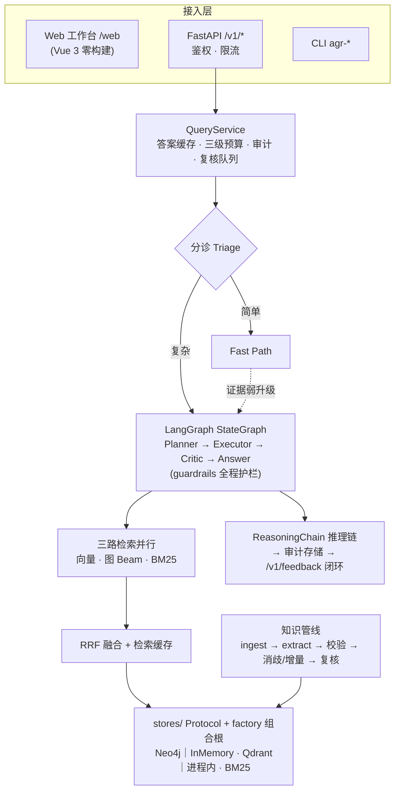

# 🧠 AgenticGraphRAG

**图谱增强的多跳推理问答系统 —— 知识图谱作结构化记忆，Agent 作决策大脑**

[](./pyproject.toml)
[](https://github.com/astral-sh/ruff)
[](./pyproject.toml)
[](https://github.com/langchain-ai/langgraph)


[✨ 特性](#-核心特性) · [🚀 快速开始](#-快速开始) · [🏛 架构](#-架构) · [🔌 API](#-api-一览) · [📊 评测](#-评测工具) · [📚 文档](#-文档导航)

</div>

---

## 📖 简介

纯向量 RAG 在「A 的母公司的 CEO 是谁」这类**跨实体 / 跨文档多跳问题**上难以稳定召回中间 实体。AgenticGraphRAG 用知识图谱承载结构化事实，用 Agent 循环（规划 → 执行 → 反思 → 护栏）决策检索与推理路径，在**可审计、成本可控**的前提下提升多跳问答准确率与可解释性。

设计上的一等公民是**离线确定性**：图 / 向量 / LLM 每一层都有离线与在线双实现，默认全离线（内存图 + seed 三元组 + Mock LLM）。克隆仓库后**不需要任何 API Key 和 Docker** 即可跑通全流程与 20 case 评测，CI 与评测因此完全可复现。

## ✨ 核心特性

- 🧭 **复杂度分诊 + 双路径** — 简单问题走 Fast Path（证据弱自动升级），复杂问题走 LangGraph Agentic 循环（Planner → Executor → Critic → Answer），checkpointer 持久化中间状态
- 🔍 **三路混合检索** — 向量 / 图路径 Beam Search / BM25 并行召回，RRF 融合 + 检索缓存 + Reranker 协议
- 🕸 **知识管线** — 文档接入 → LLM 抽取 → Schema 校验 → 实体消歧 / 增量更新 → 人工复核队
列（journal / retry / quarantine 全程留痕）
- 🛡 **全程护栏** — 最大跳数、LLM 调用数、token 三级预算（单查询 / 用户 / 租户）、超时与
递归上限；LLM 熔断器、`GraphRecursionError` 自动恢复、Neo4j 不可达回退内存图
- 🔗 **可审计推理链** — 每次问答输出带引用绑定的 `ReasoningChain`（JSON Schema 契约 [`configs/schema/reasoning_chain_v1.json`](./configs/schema/reasoning_chain_v1.json)），入审计存储、可按 query ID 回查；`/v1/feedback` 反馈闭环接人工复核队列
- 📡 **真·增量 SSE** — 基于 LangGraph `stream(updates)` 逐 hop 推送分诊 / 子问题 / 思考 过程，流中可中止
- 🔐 **多租户与 RBAC** — API Key → 租户映射 + 三角色（admin/operator/reader）路由守卫与 key 过期、QPS 与并发限流（per-tenant 可配 `tenants:`）、三级预算与审计 / 缓存隔离、`tenant_id` 数据级隔离贯穿存储 / 检索 / Agent
- 🏢 **企业级可观测与治理** — 结构化 JSON 日志（request/query/tenant/user 上下文贯穿）、安全事件审计流、admin 排障端点（trace / 预算快照 / 审计事件）、Prometheus `/metrics-prom`、可选 OTel OTLP + W3C traceparent、PII 脱敏与保留期清理
- 🖥 **零构建 Web 工作台** — Vue 3 ESM（钉版 3.5.13、无 npm，ADR-006）多视图界面：引用角标、推
理链树、图路径 chips、逐 turn 反馈


## 🏛 架构



**离线 / 在线双轨（默认离线）** — 这是理解本仓库的第一把钥匙：

| 层 | 离线（默认） | 在线（显式开启） |
|---|---|---|
| 图 | `InMemoryGraphStore` + `data/processed/seed_triples.jsonl` | Neo4j（`AGR_USE_LIVE_STORES=1` 或 `--neo4j`） |
| 向量 | 进程内 + 已持久化 embedding | Qdrant |
| LLM | `MockLLMProvider` + 离线答案启发式 | 真实 Provider（`AGR_ALLOW_LLM=1` + `LLM_API_KEY`） |

> ⚠️ `generation/offline_heuristics/` 是只服务演示语料的确定性规则集（保 CI 可复现），**不是生产路径**：不要用它「修」在线 LLM 的行为，反之亦然。详见 [docs/ARCHITECTURE.md](./docs/ARCHITECTURE.md) 与系统级不变量 [Spec.md](./Spec.md)。

## 🚀 快速开始

### 安装

```bash
uv venv .venv && source .venv/bin/activate
uv pip install -e ".[dev]"
cp .env.example .env        # 离线路径不需要填任何 Key
```

### 30 秒离线体验（无 LLM、无 Docker）

```bash
# 20 case 端到端评测（自动加载 seed 三元组，无需先建图）
agr-run-cases --no-llm      # → reports/poc_run.jsonl + accuracy

# 单条多跳问答
agr-query --no-llm "Who is the CEO of Apex Holdings?"

# 评分
python -m agentic_graphrag score
```

### API + Web 工作台

```bash
agr-api                     # 或 uvicorn agentic_graphrag.api.app:create_app --factory --port 8000

curl -s http://127.0.0.1:8000/healthz
curl -s -X POST http://127.0.0.1:8000/v1/query \
  -H 'Content-Type: application/json' \
  -d '{"question":"Who is the CEO of Apex Holdings?","max_hops":4}'
# 浏览器打开 http://127.0.0.1:8000/web
```

默认全离线（seed 三元组 + 内存图 + Mock LLM）。完全断网环境先按 [`web/static/vendor/README.md`](./web/static/vendor/README.md) 预取前端 vendor。

<details>
<summary><b>🔴 开启 Live 模式（真实 LLM / Neo4j / Qdrant）</b></summary>

```bash
docker compose up -d        # Neo4j: 7474/7687 (neo4j/agentic-graphrag) · Qdrant: 6333
# .env 填 LLM_API_KEY 后：
AGR_ALLOW_LLM=1 AGR_USE_LIVE_STORES=1 agr-api
```

| 环境变量 | 说明 |
|---|---|
| `AGR_ALLOW_LLM=1` | API 启用真实 LLM 答案路径 |
| `AGR_USE_LIVE_STORES=1` | API 使用 Neo4j / Qdrant（否则始终离线存储） |
| `AGR_REQUIRE_AUTH=1` | 强制 API Key 鉴权 |
| `AGR_API_KEYS=tenant:key:role,...` | 租户密钥表（role ∈ admin/operator/reader，缺省 reader；兼容旧 `tenant:key`） |
| `AGR_RATE_LIMIT_QPS` / `AGR_RATE_LIMIT_CONCURRENT` | 租户 QPS / 并发上限（per-tenant 覆盖见 `configs/default.yaml` `tenants:`） |
| `AGR_TRUST_X_USER_ID=1` | 显式信任客户端 `X-User-Id`（默认绑定 key 摘要） |
| `AGR_LOG_LEVEL` / `AGR_LOG_FILE` | 结构化 JSON 日志级别 / 落盘（ENT-01） |
| `AGR_REDACTION_ENABLED` / `AGR_OTEL_*` | PII 脱敏、OTel OTLP 导出（ENT-06/08，需 `.[otel]` extra） |

完整清单见 [docs/ops-runbook.md](./docs/ops-runbook.md)；无 Docker 环境的 Neo4j 裸机方案见 [docs/EXTERNAL_RUNTIMES.md](./docs/EXTERNAL_RUNTIMES.md)。

</details>

<details>
<summary><b>🕸 知识管线（接入 → 建图 → 索引）</b></summary>

```bash
# 离线 seed 变体（不调 LLM）
agr-ingest
agr-build-graph --triples data/processed/seed_triples.jsonl --no-llm
agr-index --no-embed

# 全量 LLM 抽取（需 LLM_API_KEY + Neo4j，无自动回退）
agr-ingest && agr-build-graph && agr-index && agr-run-cases
```

> `--no-llm` **不等于**自动跳过 Neo4j：seed 建图在 Neo4j 不可用时会**自动回退**内存图并 打 Warning；`--memory-graph` 可强制进程内 dry-run。真实领域语料导入按 [docs/REAL_DOMAIN_PLAYBOOK.md](./docs/REAL_DOMAIN_PLAYBOOK.md) 走 `./scripts/import_real_corpus.sh`。

</details>

<details>
<summary><b>⌨️ 全部 CLI 入口</b></summary>

`agr-ingest` · `agr-build-graph` · `agr-index` · `agr-run-cases` · `agr-run-baseline` · `agr-eval` · `agr-gen-cases` · `agr-pilot-triples` · `agr-badcase` · `agr-query` · `agr-api`

所有子命令同样可通过 `python -m agentic_graphrag <command>` 调用（另含 `score` / `spotcheck` / `score-spotcheck` / `export-reasoning-schema` 等）。`pyproject.toml` 已设 `pythonpath = ["src"]`，测试无需安装即可运行。

</details>

## 🔌 API 一览

| 端点 | 用途 |
|---|---|
| `POST /v1/query` · `POST /v1/query/stream` | 问答（同步 / SSE 真·增量，流中可中止） |
| `GET /v1/me` | 当前租户身份、角色与工作台功能权限 |
| `POST /v1/docs` · `GET /v1/ingest-tasks` · `GET /v1/ingest-tasks/{task_id}`（admin/operator） | 文档接入（≤5 MiB/文件、≤20/批、UTF-8 md/txt）与租户隔离任务分页 / 查询 |
| `GET /v1/audit/queries/{query_id}` | 推理链审计回查（AC-3，自租户） |
| `POST /v1/feedback` | 反馈闭环 → 不准确项入复核队列 |
| `GET /v1/review-queue` · `POST /v1/review-queue/{item_id}/decision`（admin/operator） | 人工复核（列表自租户） |
| `GET /v1/metrics` · `GET /v1/traces/{id}` · `GET /v1/budget/snapshot` · `GET /v1/audit-events`（均 admin） | 观测指标 / trace 回查 / 预算快照 / 安全事件（ENT-02/03） |
| `GET /v1/graph/entities` | 图实体分页浏览；支持名称、别名、ID 搜索与类型筛选 |
| `GET /healthz` · `GET /metrics-prom` · `GET /web` | 健康检查 / Prometheus 抓取 / Web 工作台（均免鉴权） |

## 🖥 Web 工作台

基于 Vue 3 的角色感知工作台，由 `agr-api` 静态挂载于 `/web`。包含知识问答、文档接入、人工审核、实体浏览和系统观测视图；导航按 `/v1/me` 返回的角色能力显示，服务端仍执行最终权限校验，并支持窄屏布局。问答提供流式推理、引用证据、反馈和审计回查；任务与审核队列支持分页，实体列表支持搜索、类型筛选和分页；管理员可查询进程指标、预算、安全事件及查询审计 / trace。

文档上传目前接收 UTF-8 Markdown / 纯文本并创建任务，不会自动抽取三元组或写入图谱；任务处理由单独的 ingest worker 执行。默认离线向量与 BM25 索引是进程内存，独立 worker 完成索引不代表 API 查询进程已获得这些索引。图谱浏览提供实体记录，不提供关系邻域详情；指标与 trace 也受服务进程生命周期限制。工作台会显示服务端状态与可用性错误。

## 📊 评测工具

```bash
agr-run-cases --no-llm                        # 离线评测（确定性）
python -m agentic_graphrag run-baseline --no-llm   # 纯向量 RAG 基线对照
python -m agentic_graphrag badcase            # 坏例归因
```

数据集位于 [`evals/datasets/`](./evals/datasets/)，包含不同用途的评测集与确定性金标模板；标注规范见 [`ANNOTATION_SPEC.md`](./evals/datasets/ANNOTATION_SPEC.md)。

## 📚 文档导航

| 文档 | 内容 |
|---|---|
| [PRD.md](./PRD.md) | 产品需求与验收标准 |
| [Spec.md](./Spec.md) | 系统级规则与不变量（架构 / 运行时 / 契约 / 安全） |

## 📁 仓库布局

```
configs/            # 配置、JSON Schema、Prompt（无密钥）
src/agentic_graphrag/
  api/              # FastAPI：envelope、query/stream、鉴权限流、反馈
  agent/            # 分诊 / Fast Path / LangGraph 循环 / 护栏 / checkpointer
  retrieval/        # 向量 / 图 Beam / BM25 + RRF 融合 + 缓存
  knowledge/        # 接入、抽取、建图、增量、消歧、复核队列
  llm/              # LLMClient 协议 + Provider + 三级预算 + 熔断
  stores/           # Repository 协议 + factory 组合根（唯一入口）
  generation/       # 答案生成 + ReasoningChain（offline_heuristics 仅演示）
  observability/    # trace·metrics·JSON 日志·安全审计流·PII 脱敏·OTel 桥接
  eval/ · cli/      # 金标 / 评分 / badcase · agr-* 入口
web/                # Web 工作台（Vue 3 零构建）
data/ · evals/      # 语料与 seed 三元组 · 评测数据集
tests/ · scripts/   # 单元测试 · 门禁 / 评测 / 压测脚本
docs/               # 架构、产品与运维文档
.github/workflows/  # CI（lint + unit + coverage ≥80%）
```

## 🛠 开发

```bash
ruff check src tests scripts && ruff format --check src tests scripts   # Lint（CI 强制 ）
pytest tests/unit --cov=agentic_graphrag --cov-fail-under=80 -q         # 测试 + 覆盖率 门禁
python scripts/check_code_metrics.py    # 硬指标：文件≤300行 · 函数≤50行 · 嵌套≤3 · 参数≤3 · CC≤10
```

技术选型（已采纳）：Neo4j 5 Community · Qdrant · rank_bm25 · LangGraph StateGraph（ADR-005）· Python 3.12 + Pydantic v2 · Vue 3 零构建（ADR-006）。约定：模块目标 200–400 行（deliberately split）、覆盖率 omit 清单有意维护（勿静默扩大）、提交前过 [`plan/engineering/rules.md`](./plan/engineering/rules.md) 安全清单。
