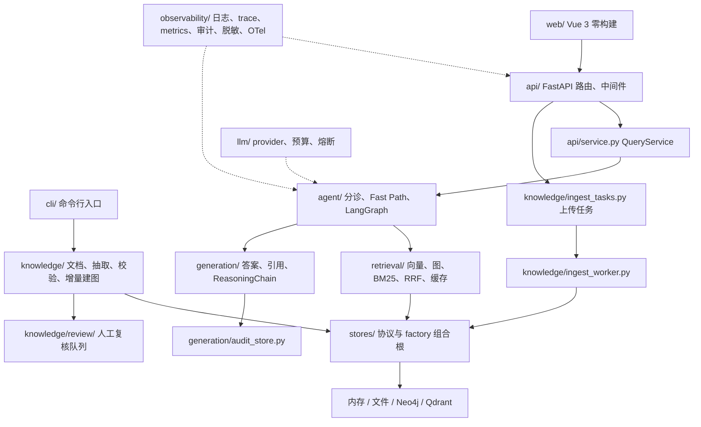

# 架构说明（ARCHITECTURE）

**更新日期：** 2026-09-23
**定位：** 描述当前代码中已实现的模块边界、运行路径与已知运行限制，不是目标架构或静态审计报告。强制性工程规则以 [`plan/engineering/rules.md`](../plan/engineering/rules.md) 为准；业务行为细节见 [`BUSINESS_LOGIC.md`](./BUSINESS_LOGIC.md)，企业能力状态见 [`ENTERPRISE_READINESS.md`](./ENTERPRISE_READINESS.md)。

## 1. 模块与依赖边界



| 模块 | 当前职责 |
|---|---|
| `api/`、`cli/`、`web/` | HTTP、命令行与试用 UI 接入；API 通过 `QueryService` 调用应用流程。 |
| `agent/` | 问题分诊、Fast Path、规划与执行状态机、反思、护栏及 SSE 进度事件。 |
| `retrieval/`、`generation/` | 多路检索与融合；生成带证据引用的答案和统一推理链。 |
| `knowledge/` | 文档切块、逐块抽取、schema/confidence gate、实体解析、增量冲突处理及人工复核。 |
| `stores/`、`llm/` | 存储协议和后端组合；LLM provider、调用预算及熔断机制。 |
| `observability/`、`eval/` | 日志、trace、指标、安全审计、脱敏、可选 OTel，以及离线评测。 |

应用层通过 `stores/interfaces.py` 中的 `GraphStore`、`VectorStore`、`FulltextStore`、`DocStore` 协议访问知识存储。`stores/factory.py` 是存储组合根；Neo4j、Qdrant 的具体客户端留在存储实现内。限流、预算与审计调度协议另见 `stores/scheduling_protocols.py`。

## 2. 存储与运行模式

离线为默认路径；`AGR_ALLOW_LLM` 与 `AGR_USE_LIVE_STORES` 是**相互独立**的开关，可分别切换模型和图/向量后端。

| 能力 | 离线默认 | Live 配置与边界 |
|---|---|---|
| 图存储 | `InMemoryGraphStore`；离线 API 默认加载 seed triples | `AGR_USE_LIVE_STORES=1` 使用 Neo4j；图后端不可用时是否回退内存图由调用方策略决定。 |
| 向量存储 | 进程内向量存储，可加载已保存 embeddings | Live bundle 使用 Qdrant；初始化失败时当前 factory 回退到内存向量存储。 |
| 全文与文档 | BM25 全文索引、文件型 `DocStore` | 当前没有独立的在线全文服务或文档数据库后端；Live bundle 仍使用 BM25 与文件型文档存储。 |
| LLM | `MockLLMProvider` 与确定性离线答案规则 | `AGR_ALLOW_LLM=1` 且提供有效 `LLM_API_KEY` 后启用真实 provider；不会因此自动切换存储。 |

`generation/offline_heuristics/` 面向仓库演示语料，保证无外部服务时可复现；它不是 Live LLM 的回答实现。反过来，调整在线提示词或 provider 也不会改变离线规则答案。

## 3. 查询生命周期

1. `POST /v1/query` 或 `POST /v1/query/stream` 经 `AuthRateLimitMiddleware` 处理。启用 API Key 鉴权时，中间件解析 `Principal`、租户与角色，并执行租户限流；未配置身份时使用默认匿名身份。
2. `QueryService` 组装存储、Agent、答案/检索缓存、审计存储、复核队列和多级预算。非流式请求先查答案缓存，再预留预算；缓存键包含租户、用户及影响结果的请求参数。
3. Agent 处理问候等无需检索的场景后进行 triage：简单问题尝试 Fast Path；证据不足时可升级到 Agentic。禁用 triage 或请求 `force_agentic` 时直接进入 Agentic。
4. Agentic 使用 LangGraph `StateGraph`，由 planner 生成带依赖关系的子问题 DAG，executor 执行就绪节点，critic 决定继续探索或结束并生成答案。计划广度与 hop 深度分别受限；因预算未执行或未纳入计划的子问题会记录到推理链 metadata。
5. Executor 并行执行向量、图 beam 与 BM25 检索，经 RRF 融合并可使用检索缓存。`tenant_id` 随请求进入 Agent、存储检索和租户范围的缓存键。
6. Guardrails 限制 hop 数、子问题广度、LLM 调用数、token 与耗时，并设置 LangGraph 递归上限。生成阶段把事实 claim 绑定到检索证据；引用校验失败时最多重试一次，仍不满足时走保守回答/拒答路径。该校验是规则性证据支持检查，不等同于完整的自然语言蕴含判定。
7. 返回 `ReasoningChain`（契约见 `configs/schema/reasoning_chain_v1.json`），持久化审计记录、结算预算并记录指标。SSE 端点额外逐步发送 triage、思考、子问题、hop 与最终答案事件；查询执行不跨整个 SSE 生命周期持有进程级全局锁。

### 租户上下文

`tenant_id` / `user_id` 在 API 身份上下文中传递：租户用于预算、检索与答案缓存、推理审计、上传任务、复核队列及图实体浏览；用户标识用于预算、答案缓存与审计。缓存命中还有租户元数据二次校验；找不到资源与跨租户资源对外统一返回未找到，避免泄漏资源是否存在。具体数据隔离依赖各存储实现及其 `tenant_id` 过滤实现，不应把此应用层约束误认为独立数据库或物理分区。

## 4. 知识构建与上传索引

当前有两条用途不同的路径，不应将 API 文件上传等同于完整的图谱抽取：

```text
离线/CLI 图谱构建：文档 → chunk → extract pipeline（journal / retry / quarantine）
    → schema 与置信度 gate → entity resolution → 增量冲突处理
    → graph store；不确定冲突 → review queue → 人工决策

API 文档上传：POST /v1/docs（md/txt）→ IngestTaskStore（JSONL 任务）
    → 单独运行的 ingest worker → DocStore → chunk → vector / BM25 索引
```

图谱增量更新不清空既有图：新 triples 先通过 schema/confidence gate，再与现有边比较。完全相同的边仅在置信度有意义提升时更新；同一主体与关系出现不同对象时，按置信度差距自动更新、送人工复核或保留旧边，并在自动更新时退役被替代边。写入统计以存储实际接受的数量为准。

上传接口当前只接受 UTF-8 Markdown 与纯文本，单文件上限 5 MiB、每批最多 20 个文件；PDF 尚无解析器，不支持上传。API 会创建任务，但**不会自动启动 worker**；使用 `python -m agentic_graphrag.knowledge.ingest_worker --once` 消费任务。当前任务文件存储与 worker 处理记录面向单机/单进程使用，不提供多节点队列所需的共享锁或原子租约保证。

## 5. API 与运维入口

| 路由 | 用途 |
|---|---|
| `POST /v1/query`、`POST /v1/query/stream` | 同步问答、增量 SSE 问答。 |
| `POST /v1/docs`、`GET /v1/ingest-tasks/{task_id}` | 上传文档并查询后台索引任务。 |
| `GET /v1/review-queue`、`POST /v1/review-queue/{item_id}/decision` | 查看并处理人工复核项。 |
| `GET /v1/graph/entities` | 分页浏览图实体。 |
| `GET /v1/audit/queries/{query_id}`、`POST /v1/feedback` | 按租户查询推理审计并提交反馈。 |
| `GET /v1/traces/{query_id}`、`GET /v1/budget/snapshot`、`GET /v1/audit-events` | 管理员排障与安全事件查询。 |
| `GET /v1/metrics`、`GET /metrics-prom` | 指标摘要与 Prometheus exposition。 |
| `GET /healthz`、`GET /web` | 健康检查与试用 UI。 |

角色守卫定义在 `api/rbac.py`；具体路由权限以路由声明为准。结构化日志、trace、Prometheus 指标、安全审计事件、PII 脱敏与可选 OTLP bridge 位于 `observability/`。CLI 入口由 `pyproject.toml` 声明，也可使用 `python -m agentic_graphrag <command>`。

## 6. 配置与相关文档

`configs/default.yaml` 提供应用参数，`config.py` / `config_enterprise.py` 将其解析为配置模型；`.env` 与 pydantic-settings 管理密钥和服务端点。部分 API/观测运行时开关按调用点直接读取 `AGR_*` 环境变量。部署与变量清单见 [`ops-runbook.md`](./ops-runbook.md)，Neo4j 外部运行时见 [`EXTERNAL_RUNTIMES.md`](./EXTERNAL_RUNTIMES.md)。

本文只维护实现架构与路径说明：目标设计见 [`ARCHITECTURE_DESIGN.md`](./ARCHITECTURE_DESIGN.md)，实现差异盘点见 [`DESIGN_VS_IMPLEMENTATION.md`](./DESIGN_VS_IMPLEMENTATION.md)，业务规则及未解决缺口见 [`BUSINESS_LOGIC.md`](./BUSINESS_LOGIC.md) 与 [`IMPORTANT.md`](./IMPORTANT.md)。
