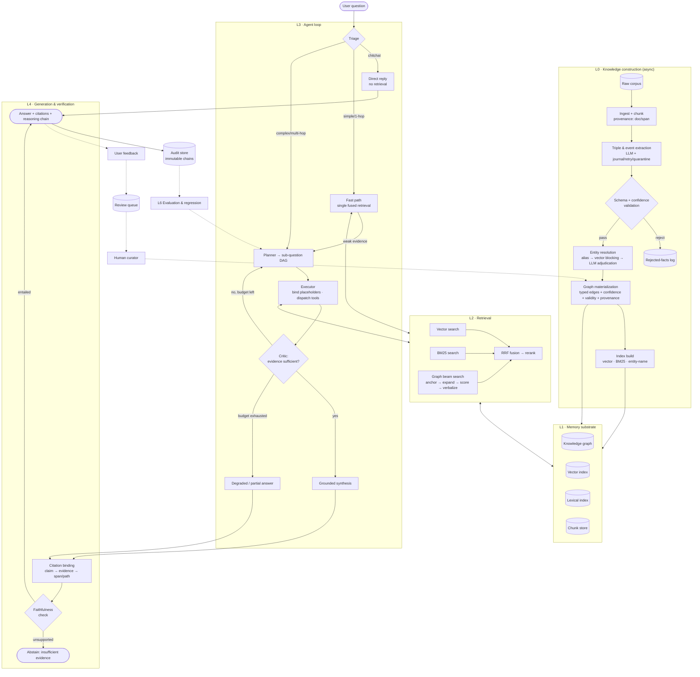
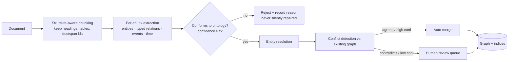
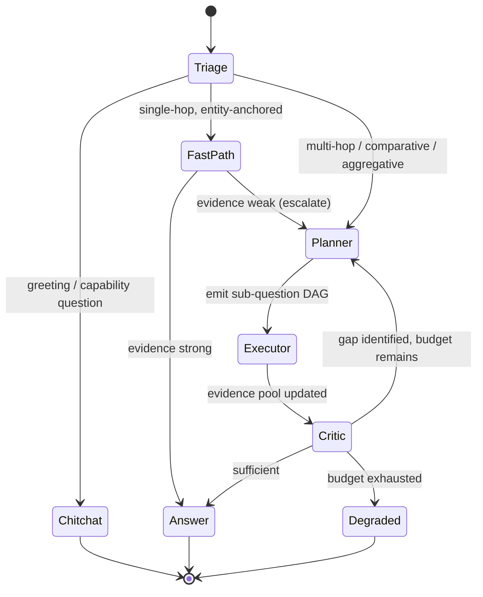

# Graph-Enhanced Multi-Hop Reasoning QA — Architecture Design

> **Provenance of this document.** This is a *clean-room* design derived only from the one-line
> project premise: *"Graph-enhanced multi-hop reasoning Q&A system — knowledge graphs as structured
> memory, agents as the decision brain."* No source code, PRD, or plan document in this repository
> was consulted while writing it. It therefore describes what such a system **should** be, not
> necessarily what the current implementation **is**. Where the two disagree, treat this file as a
> design reference and the code as the authority. A point-by-point diff against the implementation
> is in [`DESIGN_VS_IMPLEMENTATION.md`](DESIGN_VS_IMPLEMENTATION.md).

---

## 1. Reading the premise

The name makes two architectural commitments and one problem claim. Everything below follows from
unpacking them.

| Phrase | Commitment |
|---|---|
| *multi-hop reasoning QA* | The unit of work is a question whose answer requires **composing ≥2 facts** that appear in different places in the corpus. |
| *knowledge graph as structured memory* | Memory is **explicit, typed, and relational** — not a bag of embeddings. It is queried by *traversal*, and every element carries provenance. |
| *agent as decision brain* | Retrieval strategy is **decided at runtime**, not fixed at design time. There is a plan, an execution, a self-check, and a stopping rule. |

### 1.1 The problem being solved

Vanilla vector RAG fails on multi-hop questions for a structural reason, not a tuning reason.

> **Q:** *"Who is the CEO of the parent company of Acme Robotics?"*
>
> The corpus contains two facts, in two unrelated documents:
> 1. `Acme Robotics —subsidiary_of→ Zenith Group` (in an M&A filing)
> 2. `Zenith Group —ceo→ Jane Roe` (in a corporate governance page)
>
> Fact 2 — the fact that actually contains the answer — **does not mention Acme Robotics at all.**
> Its embedding has near-zero similarity to the question. No amount of `top_k`, chunk-size tuning,
> or reranking retrieves it, because similarity search can only find what *looks like* the query.

The bridge entity (`Zenith Group`) is discoverable only *after* hop 1 resolves. This yields the
system's founding thesis:

> **Retrieval must be a traversal, not a lookup — and the traversal must be planned, not fixed.**

The knowledge graph supplies the traversal. The agent supplies the plan. Neither alone is
sufficient: a graph without an agent needs the user to hand-write the query path; an agent without a
graph has nothing to traverse and degenerates into iterative vector search over the same
un-retrievable chunk.

### 1.2 Design principles (binding on everything below)

1. **Determinism-first duality.** Every external dependency (graph DB, vector DB, LLM) has an
   in-process offline stand-in, and *offline is the default*. CI, unit tests, and the regression
   evaluation must run with no network and no API key. Live backends are opt-in switches.
2. **Contract-first.** All retrievers emit one `Candidate` shape; all runs emit one `ReasoningChain`
   shape. Adding a retriever means conforming to the contract, not inventing a parallel one.
3. **Grounded-or-abstain.** An honest *"insufficient evidence"* is a **successful** outcome. A
   fluent unsupported answer is a **failure**, and is measured as such (fabrication rate).
4. **Provenance is mandatory.** Every graph edge points back to the source span that produced it.
   An un-attributable fact cannot enter memory.
5. **Cost and latency are enforced, not advised.** Hop count, LLM calls, tokens, and wall-clock are
   hard budgets checked inside the loop, with graceful degradation on breach.
6. **Swappable backends behind narrow protocols.** Application code never imports a database client
   type. One composition root wires concrete stores.

---

## 2. Layered architecture

```
┌──────────────────────────────────────────────────────────────────────────────┐
│  L5  SERVICE & GOVERNANCE                                                    │
│      REST + SSE streaming · AuthN/AuthZ · RBAC · multi-tenancy · quotas      │
│      observability (logs/metrics/traces) · audit trail · feedback intake     │
├──────────────────────────────────────────────────────────────────────────────┤
│  L4  GENERATION & VERIFICATION                                               │
│      grounded synthesis · citation binding · faithfulness check · abstention │
│      reasoning-chain export (versioned schema)                               │
├──────────────────────────────────────────────────────────────────────────────┤
│  L3  AGENT — THE DECISION BRAIN                                              │
│      triage/router · planner (sub-question DAG) · executor · critic/reflect  │
│      working memory · guardrails · circuit breaker                           │
├──────────────────────────────────────────────────────────────────────────────┤
│  L2  RETRIEVAL                                                               │
│      vector · lexical/BM25 · graph traversal (beam search) → fusion (RRF)    │
│      path verbalization · rerank · retrieval cache                           │
├──────────────────────────────────────────────────────────────────────────────┤
│  L1  MEMORY SUBSTRATE (protocols: GraphStore/VectorStore/FulltextStore/Docs) │
│      knowledge graph · embeddings · inverted index · chunk store             │
│      episodic (per-query) memory · audit store · review queue                │
├──────────────────────────────────────────────────────────────────────────────┤
│  L0  KNOWLEDGE CONSTRUCTION (offline / async)                                │
│      ingest → chunk → extract → schema-validate → resolve entities →         │
│      materialize graph → build indices → incremental update & conflict merge │
└──────────────────────────────────────────────────────────────────────────────┘
        ▲                                                              │
        └────────────── feedback / correction loop (L5 → L0) ──────────┘
```

**L3 is the only layer permitted to make control decisions.** L2 answers questions it is asked; it
never decides *which* question to ask. This separation is what keeps retrieval unit-testable without
an agent runtime, and the agent testable without a database.

---

## 3. The system logic graph

End-to-end control and data flow. Solid = request path; dashed = asynchronous / feedback.



**The three cycles.** A system like this is defined by its loops, and there are exactly three:

| Cycle | Span | Period | Purpose |
|---|---|---|---|
| **Reasoning loop** | `planner → executor → critic → planner` | seconds | Acquire the *next* hop's evidence. Bounded by hop/LLM/token/time budgets. |
| **Correction loop** | `answer → feedback → review queue → graph` | hours–days | Repair wrong or stale memory. Makes the KG an asset that improves. |
| **Improvement loop** | `audit → evaluation → prompts/policy/config` | release cycle | Prevent regressions; justify each component by ablation. |

---

## 4. Component design

### 4.1 L0 — Knowledge construction

The quality ceiling of the whole system is set here. If a bridge fact is never extracted, no agent
can reason over it.



Design decisions worth defending:

- **Reject, never repair.** A triple that violates the ontology is logged and dropped. Auto-coercing
  it pollutes memory with plausible-looking noise that is undetectable downstream.
- **Resume journal + quarantine.** Extraction over a large corpus is a long, partially-failing,
  expensive LLM job. It must be restartable per chunk, retry transient failures, and quarantine
  permanent ones rather than aborting the run.
- **Three-tier entity resolution.** (1) deterministic alias/normalization, (2) embedding-based
  blocking for candidate pairs, (3) LLM adjudication only for the ambiguous residue. Cost scales
  with ambiguity, not corpus size. Resolution errors are *silent poison* — merging two distinct
  people creates fabricated multi-hop paths that look perfectly well-formed.
- **Temporal validity and confidence on every edge.** "CEO of" is time-scoped. Without
  `valid_from`/`valid_to`, the graph confidently returns last decade's answer.
- **Provenance edge to source span.** Required for citation (L4) and audit (L5).

### 4.2 L1 — Memory substrate

Four narrow protocols — `GraphStore`, `VectorStore`, `FulltextStore`, `DocStore` — each with an
in-memory implementation (default, deterministic) and an optional server-backed one (graph DB,
vector DB). A single composition root returns a bundle; nothing else knows which is active.

Beyond long-term memory, two shorter-lived stores matter:

- **Episodic / working memory** — per-query scratchpad: resolved entities, the evidence pool,
  visited graph nodes (loop prevention), sub-question results available for placeholder binding.
- **Audit store** — append-only reasoning chains. This is what makes the system defensible in a
  regulated setting, and the substrate for offline evaluation.

### 4.3 L2 — Retrieval: three complementary failure modes

| Retriever | Strong at | Blind to |
|---|---|---|
| Vector | paraphrase, semantic similarity | rare identifiers; relationally-distant bridge facts |
| Lexical (BM25) | exact IDs, part numbers, rare proper nouns, numerals | paraphrase |
| Graph traversal | multi-hop composition, structural constraints | anything not extracted into the graph |

They are combined, not ranked, because their failures are uncorrelated — that is the entire
justification for running three.

**Graph traversal** is the differentiating component:

1. **Anchor linking** — map question mentions to graph entities (alias index + embedding fallback);
   ambiguity produces *multiple* anchors, not a guessed single one.
2. **Beam search expansion** — from anchors, expand along typed edges to depth ≤ `max_hops`, keeping
   the top-`B` partial paths. Beam width is what makes hub nodes ("USA", "Google") tractable; a
   naive BFS explodes combinatorially on them.
3. **Path scoring** — relation-type relevance to the question × edge confidence × recency/validity ×
   inverse hub-degree penalty × path-length decay.
4. **Verbalization** — render the surviving path as natural-language evidence
   (`Acme Robotics is a subsidiary of Zenith Group; Zenith Group's CEO is Jane Roe`) so the
   generator consumes one uniform evidence format, and the path can be cited verbatim.

**Fusion** uses Reciprocal Rank Fusion: it is rank-based, so it needs no score calibration across
three retrievers whose scores are on incomparable scales. Optional cross-encoder rerank on the fused
head. A retrieval cache keyed by `(normalized_query, index_version, tenant)` absorbs repeats and is
invalidated by index version rather than by TTL.

### 4.4 L3 — The agent brain

**Triage first, because uniform agentic treatment is economically fatal.** Running a 6-LLM-call
plan/execute/reflect loop for *"hi"* or *"what is Zenith Group's revenue"* wastes cost and latency on
the majority of traffic.



- **Planner** emits a **DAG**, not a list. Independent sub-questions ("revenue of A" ∥ "revenue of
  B") execute in parallel — with a list they serialize, and latency is the product's main UX risk.
  Dependent sub-questions carry **placeholders** (`ceo_of(<answer:q1>)`) bound at execution time.
  The DAG may grow mid-run when the critic discovers a missing hop.
- **Executor** binds placeholders, selects a tool per sub-question (vector / lexical / graph / all),
  and merges results into the evidence pool with de-duplication.
- **Critic** is the component that makes this an *agent* rather than a pipeline. It asks one
  question — *does the evidence pool entail an answer?* — and returns `answer | replan | expand |
  abstain`. It must be biased toward **replan when uncertain and budget remains**, and toward
  **abstain rather than guess** when it does not.
- **Guardrails** are checked *inside* the loop, not around it: `max_hops`, `max_llm_calls`,
  `token/cost budget` (per request and per tenant), `wall-clock timeout`, `graph recursion cap`,
  plus a consecutive-failure **circuit breaker** on the LLM provider. Every breach degrades
  gracefully — return what was found, marked partial — rather than erroring out.

### 4.5 L4 — Generation and verification

Synthesis is constrained to the evidence pool. Then, and this is the part usually omitted:

1. **Citation binding** — decompose the draft answer into atomic claims; bind each to the evidence
   ids that support it. Unbindable claim ⇒ the claim is removed or the answer is downgraded.
2. **Faithfulness check** — verify entailment of each claim by its cited evidence.
3. **Abstention** — if the answer's core claim is unsupported, return *insufficient evidence* plus
   what *was* found. Measured as a first-class metric, never as an error.
4. **Reasoning chain export** — a versioned JSON artifact: question → triage decision → plan DAG →
   per-hop retrievals with scores → critic verdicts → evidence → claims → citations → budgets
   consumed. This is simultaneously the debugging tool, the audit record, and the evaluation input.

### 4.6 L5 — Service and governance

- **Streaming (SSE) is a requirement, not a nicety.** A multi-hop run takes seconds; emitting
  `triage → thinking → sub_question → hop_done → answer` turns dead air into visible reasoning, and
  incidentally exposes the product's core differentiator to the user.
- **Multi-tenancy reaches memory.** `tenant_id` threads through every store protocol, every
  retriever, and the budget accountant — tenant isolation applied only at the API edge leaks
  evidence through a shared cache.
- **Observability**: structured JSON logs with request/query/tenant correlation ids, per-query
  metrics (latency by stage, hops, LLM calls, cost, cache hit), append-only security audit events,
  optional distributed tracing.
- **Feedback closes to L0.** A "wrong answer" report attaches to the stored reasoning chain, so a
  curator sees exactly which hop failed and whether the fault was extraction, resolution, retrieval,
  or generation — then fixes the *graph*, not the prompt.

### 4.7 L6 — Evaluation

Multi-hop QA is unusually easy to fool yourself about, so measurement is a layer, not a script.

- **Gold cases generated by walking the graph.** Pick a real 2–3 hop path, instantiate a natural
  language template over it, record the path as the gold evidence set. Deterministic, no LLM,
  labels trustworthy by construction. *Known limitation:* such cases can only test hops the
  extraction stage already succeeded at — they must be supplemented by human-authored cases, or the
  evaluation becomes self-confirming.
- **Metrics**: answer accuracy (exact/fuzzy/LLM-judge), **evidence recall** (was the bridge fact
  retrieved — the metric that actually diagnoses multi-hop failure), hop correctness, fabrication
  rate, abstention correctness, p50/p95 latency, cost per query.
- **Baseline and ablations.** Vanilla vector RAG on the *identical* case set with the *identical*
  scorer is the only evidence that the graph earns its complexity. Ablations (`−graph`, `−fusion`,
  `−critic`) hold each component to the same standard.
- **Engineering-done ≠ product-accepted.** Offline deterministic results validate the machinery.
  Product claims require live-model, held-out, human-signed-off evidence. The two verdicts stay
  separate and are never conflated in a status report.

---

## 5. Worked trace

**Q:** *"Who is the CEO of the parent company of Acme Robotics, and where is that company
headquartered?"*

```
Triage        → AGENTIC (2 entities implied, possessive chain, conjunctive question)

Planner DAG
  q1: "What is the parent company of Acme Robotics?"        tool=graph      deps=[]
  q2: "Who is the CEO of <answer:q1>?"                      tool=graph|vec  deps=[q1]
  q3: "Where is <answer:q1> headquartered?"                 tool=graph|vec  deps=[q1]
                                        (q2 ∥ q3 — parallel, both depend only on q1)

Executor h1  → anchor "Acme Robotics" → edge subsidiary_of → Zenith Group  (conf 0.94, doc#412)
Critic       → q1 resolved; q2/q3 unbound → CONTINUE
Executor h2  → bind q1=Zenith Group; dispatch q2 and q3 concurrently
                q2: edge ceo → Jane Roe        (conf 0.91, doc#77,  valid_from 2023-04)
                q3: edge headquartered_in → Rotterdam, NL (conf 0.88, doc#77)
Critic       → both sub-answers supported by cited evidence → ANSWER

Generation   → "Acme Robotics' parent company is Zenith Group, whose CEO is Jane Roe [1][2].
                Zenith Group is headquartered in Rotterdam, Netherlands [2]."
Verification → 3 atomic claims, 3 bound, all entailed → PASS
Budgets      → hops 2/4 · LLM calls 4/8 · 2.9s / 15s · tokens 3.1k/12k
```

Vanilla vector RAG returns doc#412 and stops: doc#77 never mentions Acme Robotics.

---

## 6. Functional inventory

| # | Capability | Layer | Notes |
|---|---|---|---|
| F-01 | Document ingest + structure-aware chunking with provenance | L0 | md/txt/pdf/html |
| F-02 | LLM triple/event extraction with resume, retry, quarantine | L0 | restartable long job |
| F-03 | Ontology + confidence validation; reject-and-record | L0 | never auto-repair |
| F-04 | Three-tier entity resolution & disambiguation | L0 | cost scales with ambiguity |
| F-05 | Graph materialization: typed edges, confidence, validity, provenance | L0/L1 | |
| F-06 | Multi-index build (vector, lexical, entity-name) | L0/L1 | |
| F-07 | Incremental update, conflict detection, auto-merge + review queue | L0 | |
| F-08 | Swappable stores behind four protocols, offline default | L1 | determinism |
| F-09 | Vector / lexical / graph-traversal retrieval | L2 | uncorrelated failures |
| F-10 | Beam-search traversal with path scoring and verbalization | L2 | the differentiator |
| F-11 | RRF fusion, optional rerank, version-invalidated cache | L2 | |
| F-12 | Triage: chitchat / fast path / agentic, with escalation | L3 | cost control |
| F-13 | Planner emitting a dynamic sub-question DAG with placeholders | L3 | parallelism |
| F-14 | Executor with tool dispatch and evidence-pool accumulation | L3 | |
| F-15 | Critic / reflection with replan-or-stop verdict | L3 | makes it an agent |
| F-16 | Guardrails: hops, LLM calls, tokens, cost, timeout, recursion, breaker | L3 | enforced in-loop |
| F-17 | Grounded synthesis + claim-level citation binding | L4 | |
| F-18 | Faithfulness verification and calibrated abstention | L4 | metric, not error |
| F-19 | Versioned reasoning-chain export | L4 | audit + debug + eval |
| F-20 | Sync + SSE streaming query API | L5 | reasoning made visible |
| F-21 | AuthN/AuthZ, RBAC, tenant-scoped memory and budgets | L5 | isolation reaches L1 |
| F-22 | Logs, metrics, traces, append-only audit events | L5 | |
| F-23 | Feedback → review queue → curator → graph correction | L5→L0 | closes the loop |
| F-24 | Deterministic gold-case generation by graph walk | L6 | + human cases |
| F-25 | Accuracy / evidence-recall / fabrication / latency / cost metrics | L6 | |
| F-26 | Vector-RAG baseline and component ablations | L6 | justifies complexity |

---

## 7. Principal risks

Ordered by how much damage they do relative to how easily they hide.

| Risk | Why it is dangerous | Mitigation |
|---|---|---|
| **Extraction recall ceiling** | An un-extracted bridge fact is invisible to every downstream component; the system fails and cannot explain why. | Measure evidence recall separately from accuracy; keep vector+BM25 as a non-graph fallback path. |
| **Entity resolution errors** | Merging two distinct entities fabricates well-formed, confident, wrong paths. Silent by construction. | Conservative merge thresholds; review queue for the ambiguous band; audit merges. |
| **Hub-node explosion** | Traversal through high-degree nodes destroys both precision and latency. | Beam width, degree penalty in path scoring, relation-type filtering by question intent. |
| **Critic non-convergence** | Reflection loops burn the entire budget re-asking near-identical sub-questions. | Sub-question de-duplication, no-progress detection, hard hop/call caps with degraded return. |
| **Self-confirming evaluation** | Graph-walk gold cases only test what extraction already got right. | Mandatory human-authored case supplement; live held-out evidence for product gates. |
| **Staleness** | Time-scoped facts (roles, prices, org structure) silently expire. | `valid_from`/`valid_to` on edges; recency in path scoring; re-ingest cadence. |
| **Latency** | Multi-hop is inherently multi-round-trip; users abandon. | Triage away from the agentic path; parallel DAG branches; streaming; caching. |
| **Cost per query** | Plan+execute+reflect+verify can be 5–10× a single RAG call. | Triage, budgets, caching, small models for triage/critic and a large one only for synthesis. |

---

## 8. Build order

Each phase ends in something measurable; no phase depends on a later one.

1. **Skeleton & contracts** — protocols, in-memory stores, `Candidate` and `ReasoningChain` shapes,
   a seed triple set, offline end-to-end path. *Exit: a fixed question returns a cited answer with
   no network.*
2. **Retrieval** — three retrievers + RRF fusion + graph beam search. *Exit: evidence recall on a
   2-hop case set beats the vector-only baseline.*
3. **Agent** — triage, planner DAG, executor, critic, guardrails. *Exit: accuracy beats fast-path-only
   on multi-hop cases within budget.*
4. **Knowledge pipeline at scale** — real extraction with journal/retry/quarantine, resolution,
   incremental update, review queue. *Exit: a real corpus builds reproducibly.*
5. **Verification & trust** — citation binding, faithfulness check, abstention, chain export.
   *Exit: fabrication rate measured and driven down; abstention correct.*
6. **Service & governance** — API, streaming, RBAC, tenancy, observability, audit, feedback.
   *Exit: multi-tenant deployment with per-tenant budgets and an audit trail.*
7. **Evaluation hardening** — baseline, ablations, human gold cases, live held-out gates.
   *Exit: separate engineering-pass and product-accepted verdicts, both honest.*
