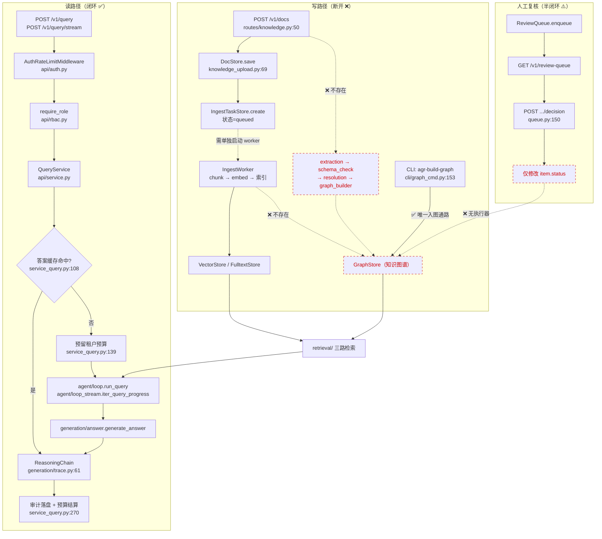
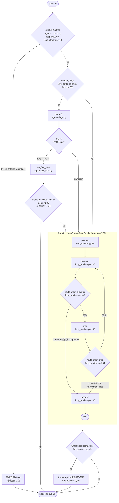
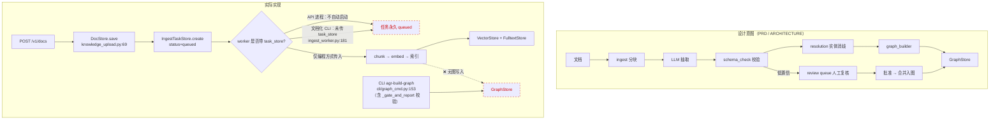
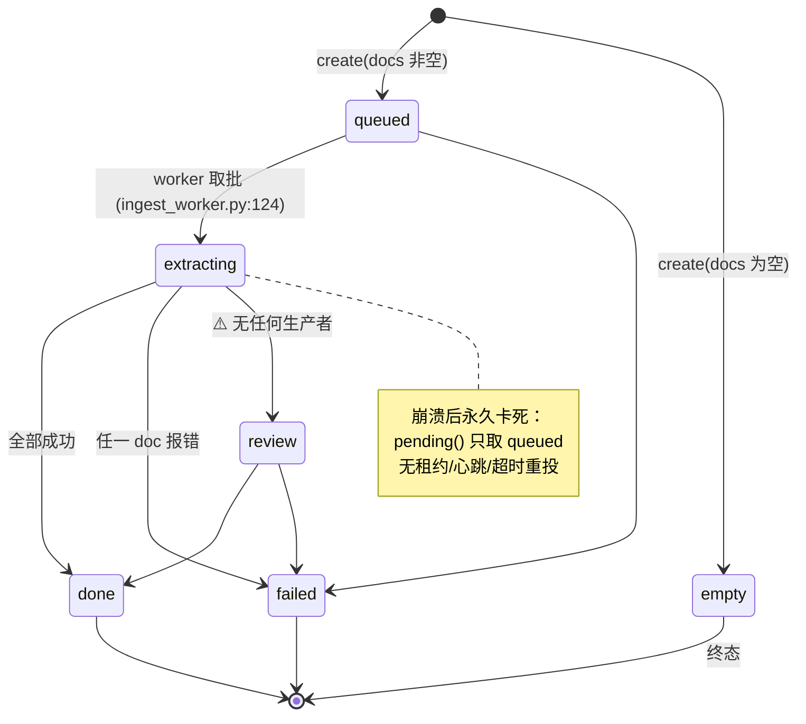
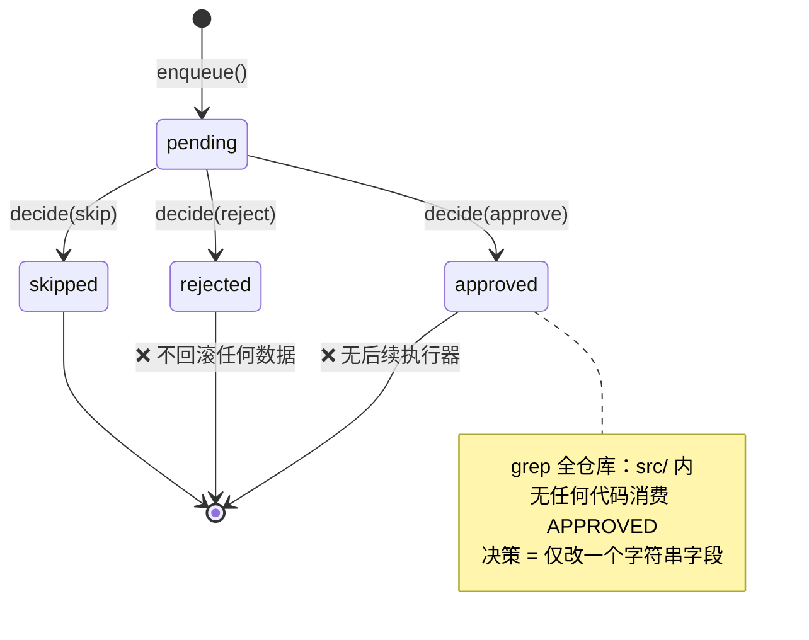

# 业务逻辑图与完整性审查（BUSINESS LOGIC）

**生成日期：** 2026-07-26
**审查方式：** 纯静态代码审查（未运行项目、未安装依赖、未执行测试；结论均给出 `file:line` 证据）
**定位：** 描述性文档 — ①全系统业务逻辑图（节点/边/判定点）；②业务逻辑**完整性**缺口清单。
**权威边界：** 强制规则以 [`plan/engineering/rules.md`](../plan/engineering/rules.md) 为准；债务与延期以 [`IMPORTANT.md`](./IMPORTANT.md) 为准；ENT 状态以 [`ENTERPRISE_READINESS.md`](./ENTERPRISE_READINESS.md) §3.5 为准；模块地图以 [`ARCHITECTURE.md`](./ARCHITECTURE.md) 为准。本文件**不**改写上述结论，只补充「逻辑是否闭环」这一维度。

---

## 0. 总体结论

| 领域 | 业务逻辑完整性 | 说明 |
|------|----------------|------|
| 查询链路（问 → 答） | **完整**（离线默认路径闭环） | triage / fast-path / agentic / guardrail / 兜底answer 全部有出口，无死循环、无「既不回答也不报错」的状态 |
| 护栏与预算 | **完整** | 每条限制都有「计数 → 判定 → 降级出口」三段，且 answer 节点保证仍产出 `ReasoningChain` |
| 检索链路 | **基本完整** | 三路检索共用 `Candidate` 契约，RRF 融合、缓存失效闭环 |
| 输出契约 | **基本完整** | `ReasoningChain` 各路径均产出；但**在线**引用门禁存在语言性缺陷（见 BL-02），且门禁强度仅到词面重叠（见 BL-13） |
| **知识写入链路（文档 → 图谱）** | **已闭环（2026-09-06，BL-01 关闭，见 §7）** | 运行期入图通路已建成（`knowledge/graph_ingest.py` + worker `graph_pipeline`）；抽取产线在无 LLM 时落 REVIEW 而非静默丢图 |
| **人工复核闭环** | **已闭环（2026-09-06，BL-03 关闭，见 §7）** | `ReviewExecutor` 把决策作用于图谱，decision 响应携带 `graph_effects`；UI 展示写回结果 |
| 多租户隔离 | **不完整（关键）** | SSE 流式路径未把 `tenant_id` 注入 Agent 状态，导致跨租户检索 + 共享缓存（见 BL-04） |
| 摄取任务状态机 | **部分完整** | `REVIEW` 态无生产者；`EXTRACTING` 崩溃后永久卡死（见 BL-05 / BL-06） |
| 计划（DAG）执行语义 | **部分完整** | 计划是 DAG，执行是线性序；hop 预算与子问题数被混同，超量子问题静默丢弃（见 BL-12） |
| 图谱时间维度 | **已落地（2026-09-06，BL-14 关闭，见 §7）** | ADR-007：Triple/RelationRecord 增 `valid_from/valid_to`，`rid` 含时间窗，时效冲突按时间优先裁决 |

**一句话结论：** **读路径（查询/检索/生成/护栏）业务逻辑是闭环的；写路径（知识入图、人工复核、增量更新）在 API 运行期是断开的** —— 知识图谱目前只能由 CLI (`agr-build-graph`) 离线构建，产品叙事中的「上传 → 抽取 → 校验 → 复核 → 入图」在服务进程内没有实现通路。

**方法与置信度：** 四条 🔴 关键结论（BL-01…04）均经过独立对抗式复核，复核者被要求以「默认结论错误」的立场搜寻反证，四条全部成立。🟠/🟡/⚪ 条目为单次静态审查所得，证据充分但未经二次复核，落地前建议按 §5 逐条验证。

---

## 1. 全局业务逻辑图

---

## 2. 查询链路逻辑图（读路径）

### 2.1 判定点与阈值（全部已实现）

| 判定点 | 位置 | 分支 | 是否实现 |
|--------|------|------|----------|
| 闲聊短路 | `loop.py:220`、`loop_stream.py:78` | 命中 → 跳过检索；未命中 → 继续 | ✅ 两条路径一致 |
| triage 开关 | `loop.py:231` | `not enable_triage or force_agentic` → 直接 agentic | ✅ |
| 路由 | `loop.py:245` | FAST_PATH / AGENTIC | ✅ `Route` 恰好两个成员 |
| Fast Path 升级 | `loop.py:285` | 证据弱 → 回退 agentic | ✅ 流式同源 `loop_stream.py:179` |
| executor 后路由 | `loop_runtime.py:148` | done / 护栏 / 超 hop → answer；否则 critic | ✅ |
| critic 后路由 | `loop_runtime.py:234` | 三重 hop 上限兜底 → answer | ✅ 无死循环 |
| 递归上限兜底 | `loop_recover.py:49` | 捕获 `GraphRecursionError` → 从 checkpoint 重建 | ✅ 不向客户端抛裸异常 |

### 2.2 护栏：计数 → 判定 → 出口（三段齐全）

| 护栏 | 计数点 | 判定点 | 触发出口 |
|------|--------|--------|----------|
| max_hops | `guardrails.py:128` `on_hop_start` | `guardrails.py:132` | executor 直接置 `done` → answer 节点 |
| 查询超时 | `started_at`（`guardrails.py:125`） | `guardrails.py:137-144` | 同上 |
| LLM 调用数 / token | `llm/budget.py` BudgetTracker | `guardrails.py:146` | 同上 |
| recursion_limit | LangGraph 内部 | `loop.py:170` 编译期下限 `2*hops+5`（`guardrails.py:20-28`） | `loop_recover.py` 重建部分答案 |
| 租户预算 | `service_query.py:139` 预留 / `:285` 结算 | `budget_policy.MultiLevelBudget` | 429 `BUDGET_EXCEEDED` |

**关键正确性：** `loop_runtime.py:205` —— 护栏触发**且无证据**才走 `honest_fallback`；有证据则仍生成部分答案。即「护栏触发 ≠ 无答案」，符合 FR-AG-06/07。

---

## 3. 知识写入链路逻辑图（写路径）

### 3.1 摄取任务状态机（`knowledge/ingest_tasks.py:24-28`）

### 3.2 复核队列状态机（`knowledge/review/queue.py`）

---

## 4. 完整性缺口清单

严重度：🔴 关键（业务承诺无法兑现 / 数据越权）｜🟠 高｜🟡 中｜⚪ 低

**验证状态：** BL-01 / BL-02 / BL-03 / BL-04 已经过**独立对抗式复核**（复核者以「默认该结论错误」为立场，专门搜寻可推翻的调用点、默认值、中间件与并行模块），四条全部 **CONFIRMED**；复核同时修正了 BL-01 的调用点枚举、BL-02 的触发条件与行号、BL-04 的受影响子路径。其余条目为单次静态审查结论，**未经对抗复核**，标注为待验证。

**BL-12 / BL-13 / BL-14 为第二轮补充审查所得**（来源：`ARCHITECTURE_DESIGN.md` 净室设计与实现的逐条对差，见 [`DESIGN_VS_IMPLEMENTATION.md`](./DESIGN_VS_IMPLEMENTATION.md) 的 D1 / D2 / D3），同样**未经对抗复核**。该轮的第四条发现（人工复核决策无执行器，D5）与既有 **BL-03 完全重合**，故不另立条目 —— BL-03 的记述更完整（额外指出 `IncrementalUpdater._append_review` 与 `ReviewQueue` 是两套互不连通的存储）。

### 🔴 BL-01：不存在「上传文档 → 进入知识图谱」的运行期通路

| 项 | 内容 |
|----|------|
| 证据 | 全仓库图写入调用点共 7 处，**无一可从 API 运行期到达**：底层 `graph_builder.py:101-102`；`resolution_merge.py:23`（仅经 `EntityResolver._apply_merge`，而 `EntityResolver(` 只在两个单测中构造）；`api/service.py:134`（**服务构造期**加载 seed 三元组）；`cli/graph_cmd.py:153`、`cli/cases_run.py:52`（CLI）；`incremental.py:204`、`eval/p3_ev.py:166`（离线评测演练）。 |
| 证据 | `IngestWorker.process_doc`（`ingest_worker.py:70-86`）只做 chunk → embed → 向量/全文索引；其构造函数（`:50-59`）**根本没有 graph 参数**。`api/` 与 `agent/` 两个包内对 `bundle.graph` 的引用除 `service.py:134` 外全部是读操作（`app.py:169/188`、`service_helpers.py:73`、`routes/knowledge.py:216`）。 |
| 证据 | `api/app.py:28-51` lifespan 只做 `setup_logging` → 可选 OTel → `build_default_service()` → `_validate_live_credentials`，**不启动任何 worker 或线程**；`src/` 内启线程处仅 `ingest_worker.py:141`（API 从不调用）与 `service_agent.py:21` 的查询线程池。 |
| 代码自陈 | `knowledge_upload.py:83` 的任务消息即写明：`"Documents persisted to doc store; run extract pipeline offline or via worker"`。 |
| 失败场景 | 管理员通过 `POST /v1/docs` 上传新文档 → 文档可被向量/BM25 检索到 → 但其中的实体与关系**永远不会进入图谱** → 图检索（多跳推理，本项目的核心卖点）对新文档完全无效。 |
| 影响 | 产品叙事「知识图谱作为结构化记忆」在运行期只对 CLI 预构建的语料成立。 |

### 🔴 BL-02：在线回答路径的引用门禁对纯中文 claim 必然失败

| 项 | 内容 |
|----|------|
| 证据 | `generation/citations.py:142-148` `_content_tokens()` 以**空白分词**：`(text).lower().replace("-"," ").split()`。中文无空格 → 整句坍缩为一个 token（全角标点被 `isalnum()` 过滤掉，**不**起分隔作用）。`claims_lexically_supported`（`:116`，`min_overlap=1`）要求 claim 与被引证据**至少共享一个 token**。 |
| 触发条件（已精确化） | 失效点在 **claim 一侧**，与证据类型无关。判据：*claim 文本中若不含任何与证据共享的「空格分隔的拉丁/数字 token」，则必然判失败*。 |
| 实测（纯函数推演，未运行项目） | 证据 `Apex Holdings -[CEO_OF]-> Elena Varga (Person)`： · claim `Elena Varga is the CEO of Apex Holdings.` → 交集 {apex, elena, holdings, varga} → **通过** · claim `Apex Holdings的首席执行官是Elena Varga。` → 交集 {apex, varga} → **通过**（多词拉丁人名「漏」出可匹配 token） · claim `NovaTech的首席执行官是马库斯·韦伯。` → 交集 ∅ → **失败** · claim `苹果控股的首席执行官是埃琳娜·瓦尔加。` → 交集 ∅ → **失败** |
| 失败场景 | 在线路径 `generate_answer`（`answer.py:152`）→ `_apply_payload`（`:76`，`require_lexical_support` 默认 True，全仓库无任何调用点传 False）返回 None → 重生成一次（`answer.py:193`）→ 再次失败 → `honest_fallback("answer claims lacked evidence citations after regenerate")`（**`answer.py:221`**）。**纯中文问答消耗 2 次 STRONG 档 LLM 调用后退化为「无法回答」。** |
| 重试注定失败 | 重生成提示（`answer.py:100-103`）只说「每条 claim 必须带 evidence_ids」，而真实失败原因是**词面重叠**，与 id 无关 → 第二次调用是确定性浪费。 |
| 为何未被评测发现 | `answer.py:138` —— `allow_llm=False` 时直接走 `offline_answer`，**完全绕过该门禁**（`:150`、`:173` 的降级分支亦然）。`--no-llm` 的 20 例评测因此全绿。典型的离线/在线路径不对称。 |
| 三个入口均受影响 | `agent/loop_runtime.py:208`、`agent/fast_path.py:33`、`agent/loop_recover.py:83` —— 只要 `allow_llm and llm is not None` 就会过闸。 |
| 修复位置 | `generation/citations.py:144` 需改为 CJK 感知切分（CJK 连续段落须切出 unigram/bigram）。**注意：直接照搬 `stores/fulltext_store.py:11` 的 `[\w一-鿿]+` 正则无效** —— 它对 CJK 同样是「整段一个 token」。 |

### 🔴 BL-03：人工复核决策没有执行器

| 项 | 内容 |
|----|------|
| 证据 | `ReviewQueue.decide()`（`review/queue.py:150-173`）只写 `status`/`reviewer`/`decided_at`/`decision_note`。`grep -rn "APPROVED\|approved" src/`（排除 `queue.py`）**零命中** —— 无任何代码消费已批准项。 |
| 失败场景 | 运维批准一条低置信冲突 → 图谱不变；驳回一条错误三元组 → 该三元组（若已入图）不被移除。复核队列是一本**只写的台账**，不是控制面。 |
| 关联 | `IncrementalUpdater._append_review`（`incremental.py:269`）把待复核冲突写入一个**独立的 JSONL** `review_log`，与 `ReviewQueue` 是两套互不连通的存储；`GET /v1/review-queue` 永远读不到它。 |

### 🔴 BL-04：SSE 流式路径未传播 `tenant_id`，导致跨租户检索与缓存共享

| 项 | 内容 |
|----|------|
| 证据 | 同步路径 `loop_recover.py:36-46` 初始状态**含** `"tenant_id": tenant_id`（`:45`）；流式路径 `loop_stream.py:248-258` `_initial_state()` 只有 3 个参数，**不含 tenant_id**（调用点 `:223`）。全仓库 `agent/` 内 `"tenant_id"` 字面量仅两处命中：`loop_handlers.py:94`（读）与 `loop_recover.py:45`（写）。 |
| 传导链 | `loop_handlers.py:94` `tenant_id = ctx.state.get("tenant_id") or None` → 流式恒为 `None` → `executor.run(tenant_id=None)` → ① 三路检索**不做租户过滤**（`executor_dispatch.py:159/171`，图侧 `:106/:125/:146`）；② `executor.py:143` 读共享检索缓存、`:150` `cache_result=tenant_id is None` **写入**共享缓存。 |
| 存储层为「放行」而非「拒止」 | `fulltext_store.py:83` `if tenant_id is None or ...`；`vector_store.py:134` `if tenant_id is not None and ...`；`memory_graph.py:229-230` `if requested is None: return True`；Qdrant `vector_store.py:67-71` 仅在非 None 时加 `FieldCondition`。四个后端一致：`None` = 全量放行，泄漏方向而非 fail-closed。 |
| 失败场景 | 租户 A 用 `POST /v1/query/stream` 提问 → 检索命中租户 B 的实体/chunk 并作为证据引用；结果写入全局检索缓存 → 租户 B 后续同样子问题直接读到 A 的检索结果。 |
| 受影响子路径（已精确化） | 闲聊：不涉检索；**Fast Path 未升级：正确**（`loop_stream.py:177` 显式传 `tenant_id`）；**Agentic 三种进入方式全部受影响** —— triage 路由（`:146`）、`force_agentic`/`enable_triage=False`（`:100`）、**Fast Path 升级**（`:182`）；非流式 `POST /v1/query`：正确。 |
| 缓存键无租户 | `RetrievalCache.retrieval_key`（`cache.py:133`）只含 index_version + 归一化 query + tools，**不含 tenant_id**，其隔离完全依赖「租户作用域运行绕过缓存」这一约定 —— 该约定在流式路径被打破。答案缓存**不受影响**（`cache.py:150` 已含租户，另有 `service_helpers.py:148` 元数据兜底）。 |
| 与已发布承诺冲突 | `docs/ENTERPRISE_READINESS.md:278` 明写「检索三路、executor dispatch、fast path 与 agent loop 透传 `tenant_id`（**租户作用域运行绕过检索缓存**，隔离优先）」—— agent loop 一环在流式下不成立。 |
| 连带发现 | API 侧 `tenant_id` 恒非空（`api/auth.py:169/178/189`、`api/service.py:168/177` 均默认 `"default"`），因此 `executor.py:143` 的 `tenant_id is None` 判据意味着 **P3-PERF-04 检索缓存在所有非流式 API 查询上实际是失效的**，而在流式上「生效」恰恰是本缺陷的副作用。修复 BL-04 会同时让两侧都关闭该缓存 —— 需要一并决定缓存键是否改为含租户。 |
| 现有测试盲区 | `test_enterprise_completion.py:39-74` 只直接调 `store.search/neighbors`；`test_audit_tenant_cache_isolation.py` 只覆盖答案缓存与审计库；`test_live_sse_stream.py:26/51` 虽传 `tenant_id="t"` 但不做任何隔离断言。 |
| 修复位置 | `agent/loop_stream.py:223` —— `opts.tenant_id` 已在 `ctx.run_opts` 上（由 `resolved_run_opts` 填充，`loop.py:264`），只需把它并入初始状态，对齐 `loop_recover.py:45`；该行以上无需改签名。 |

### 🟠 BL-05：文档化的 worker 命令不消费任务队列

| 项 | 内容 |
|----|------|
| 证据 | `CLAUDE.md` 记载 `python -m agentic_graphrag.knowledge.ingest_worker --once  # consume queued upload tasks`，但 `ingest_worker.py:181-189` 的 `__main__` 构造 `IngestWorker(...)` **未传 `task_store=`** → `run_once()`（`:110`）走 legacy 分支遍历 `doc_store.list_ids()`。 |
| 失败场景 | 上传后运行文档化命令 → 任务状态永远停在 `queued`，`GET /v1/ingest-tasks/{id}` 永远返回 queued。且该命令另起进程调 `create_offline_bundle()`，若 doc store 为 `InMemoryDocStore`（`stores/doc_store.py:11`）则与 API 进程不共享数据，worker 看不到任何文档。 |

### 🟠 BL-06：`extracting` 态崩溃后任务永久卡死

| 项 | 内容 |
|----|------|
| 证据 | `ingest_worker.py:124` 先 `transition(QUEUED→EXTRACTING)` 再处理；`IngestTaskStore.pending()`（`ingest_tasks.py:90`）**只返回 QUEUED**；`_ALLOWED_TRANSITIONS`（`:24-28`）无 `EXTRACTING→QUEUED` 重投路径，也无租约/心跳/超时字段。 |
| 失败场景 | worker 在处理中被 kill → 任务永久停留 `extracting`，无任何机制重投或告警。 |

### 🟠 BL-07：schema 校验门禁在写入函数中是「可选参数」而非「门」

| 项 | 内容 |
|----|------|
| 证据 | `schema_check.py:3` 声明不变量「非符合 schema 的三元组被拒绝并记录，**绝不进入图**」。但 `graph_builder.load_triples_into_graph`（`:74-97`）的 `schema` 参数默认 `None`，为 `None` 时**完全跳过** `gate_triples`。 |
| 各调用点 | `cli/graph_cmd.py:153` ✅（在 `_gate_and_report` 中已提前 gate）；`api/service.py:134` ❌ 未 gate（seed 三元组，风险可接受但不变量不成立）；`incremental.py:204` ❌ **显式** `schema=None`。 |
| 叠加缺陷 | `IncrementalUpdater` 两处构造点（`eval/p3_ev.py:167`、`tests/unit/test_phase3_kg_and_budget.py:43`）**都未传 `schema=`** → `_gate()`（`incremental.py:210`）直接原样返回，增量路径既无 schema 校验也无置信度阈值。 |
| 次级 | `graph_builder.py:92` —— 即使传了 schema，`confidence_threshold=None` 时 `thr=0.0`，置信度过滤退化为空操作。 |

### 🟡 BL-08：上传校验可被绕过 + PDF 声称支持但无解析

| 项 | 内容 |
|----|------|
| 证据 | `knowledge_upload.py:23` `if ext and ext not in ALLOWED_EXTENSIONS:` —— **无扩展名文件 `ext` 为空 → 短路跳过白名单**。 |
| 证据 | `:48` 大小校验发生在 `await file.read()`（`:47`）**之后** → 5MB 限制无法阻止超大文件先进内存。 |
| 证据 | `ALLOWED_EXTENSIONS` 含 `pdf`（`:16`），但 `:54` 一律 `content.decode("utf-8", errors="replace")`，**无 PDF 文本抽取** → PDF 被存为乱码并进入分块与索引。 |

### 🟡 BL-09：跨租户越权与存在性泄漏（API 层）

| 项 | 内容 |
|----|------|
| 复核决策无租户校验 | `routes/knowledge.py:145` `svc.review_queue.decide(item_id, ...)` 不传租户；`ReviewQueue.decide`（`queue.py:150`）也不校验 —— 与 `list()`（`:126`，有 `tenant_id` 过滤）不对称。租户 A 的 operator 知道 item_id 即可决策租户 B 的条目。 |
| 图实体接口无租户过滤 | `routes/knowledge.py:208` `GET /v1/graph/entities` 既无 `require_role`，`_list_entity_records`（`:234`）调用 `lister(limit=, offset=)` **不传 tenant_id**，而 `memory_graph.list_entities`（`memory_graph.py:155`）是支持 `tenant_id` 的 —— 能力存在但未使用。 |
| 反向存在性泄漏 | `routes/knowledge.py:188-190`：他租户的 query_id → 404；**不存在**的 query_id → 200。与 `:177` 注释「404 for both missing and cross-tenant (no existence leak)」相反，可用作存在性探测。 |

### 🟡 BL-10：静默吞异常导致「成功」语义失真

| 位置 | 行为 | 后果 |
|------|------|------|
| `knowledge_upload.py:68-71` | `docs.save()` 失败 `pass` | 文档未落盘，任务仍报 `queued` 并列出该 doc；注释称「任务仍记录失败尝试」，但实际**未记录任何失败信息** |
| `service_query.py:278-282` | `audit_store.save()` 失败 `pass` | 合规审计链可静默缺失 |
| `ingest_worker.py:88-96` | 逐条 embed 失败仅 warning | 全部 embedding 失败时 `result.error` 仍为 None → 任务标记 `done`，实际 0 条入索引 |
| `incremental.py:255` | `delete_relation` 失败 `pass` | AUTO_UPDATE 后旧边残留，形成双事实 |

### ⚪ BL-11：声明但无生产者的分支 / 计数不闭合

| 项 | 证据 |
|----|------|
| `IngestStatus.REVIEW` 无生产者 | `ingest_tasks.py:18` 声明，`_ALLOWED_TRANSITIONS` 允许 `EXTRACTING→REVIEW`，但全仓库无任何 `transition(..., REVIEW)` 调用 |
| `ConflictAction.SKIP` 无生产者 | `incremental.py:28` 声明；`_decide()`（`:178`）只返回 AUTO_UPDATE / REVIEW / KEEP_OLD |
| `KEEP_OLD` 不计数 | `_collect_writes`（`:217`）只处理 AUTO_UPDATE 与 REVIEW；KEEP_OLD 既不写库也不计入 `BatchResult` 任何字段 → 批次数字不守恒 |
| 值冲突只取第一条 | `incremental.py:148` `old = value_conflicts[0]` —— 存在多条冲突边时其余被静默忽略，`_retire_conflicting_edge` 无法兑现「不留双事实」 |
| `accepted` 计数可虚高 | `incremental.py:205` `stats.get("relations", 0) or len(to_write)` —— 底层返回 0 时回退为「计划写入数」，0 写入被报成成功 |
| `persist_embeddings` 名不符实 | `cache.py:227-233` 写入的是 `{"size","hits","misses"}` 统计，**不是 embedding**，且无任何读回路径 |
| 流式缺 `request_id` | `service_stream.py:195` 调 `_finalize_chain` 未传 `request_id`（同步路径 `service_query.py:66` 传了）→ 流式审计记录 `request_id` 恒为空 |
| 流式 triage 帧不保证 | `loop_stream.py:106` 注释「clients always see a triage frame first」，但 `:107` 仅在 `force_agentic` 时发帧；`enable_triage=False` 且非 force 时无 triage 帧 |
| `_TASKS` 无界增长 | `routes/knowledge.py:22` 模块级全局 dict，只增不删，无淘汰与保留策略 |
| 复核决策非幂等 | `queue.py:150` 重复提交会覆盖 `status`/`reviewer`/`decided_at`，无终态保护 |
| 加载健壮性不对称 | `queue.py:89` `json.loads` 无 try/except（`ingest_tasks.py:116` 有）→ 单行损坏即导致 `QueryService` 初始化抛异常 |
| 上传复核置信度硬编码 | `routes/knowledge.py:68` 每次上传都以 `confidence=0.5` 入队 SPOTCHECK，非业务规则而是占位值 |

---

### 补充审查（第二轮：设计对差）

> 以下三条来自净室设计文档与实现的逐条对差，**未经对抗式复核**。均已给出 `file:line` 证据，但落地前应按 §5 的 V-16…V-19 实测确认。

### 🟠 BL-12：Planner 产出 DAG，Executor 按线性序执行；hop 预算与子问题数被混同

| 项 | 内容 |
|----|------|
| 证据（并行语义未兑现） | `plan_dag.py:124 ready_subquestions()` —— 返回「全部依赖已满足的待执行节点」，即并行分支 API —— 在 `planner.py:16,32` 被再导出、在 `tests/unit/test_planner_dag.py:44,51` 有单测，但**全仓库无任何运行期调用点**。Agent 循环改用 `current_index` 线性推进（`loop_runtime.py:122,162`；`loop_handlers.py:70,81,151,213`）。 |
| 证据（无并发能力） | 全仓库 `async def` 共 11 处且**全部位于 `api/`**；`agent/` 与 `retrieval/` 内无 `asyncio.gather` / `TaskGroup` / `to_thread`。 |
| 证据（hop ≡ 已执行子问题数） | `loop_runtime.py:110` —— `node_executor` 每次进入即 `guards.on_hop_start()`（`guardrails.py:128` `hop += 1`），而每次进入只处理 `idx` 指向的**一个**子问题（`:122-146`）。故 hop 计数等价于「已执行子问题数」，并非推理深度。 |
| 证据（子问题数无上限） | `planner.py:58-60` 对 LLM 返回的 `result.sub_questions` **不截断**，`normalize_plan`（`plan_dag.py:47`）亦不截断；`loop_handlers.py:249` 还会在运行期**插入**动态子问题，使总数进一步增长。 |
| 失败场景 | `configs/default.yaml` `max_hops: 4`。LLM planner 产出 6 个子问题（或产出 4 个后 critic 追加 2 个）→ 第 4 次 executor 后 `loop_handlers.py:64` `hop >= max_hops` 置 `done`（`loop_runtime.py:240` 同判据）→ 第 5、6 个子问题**永不执行且无告警**。护栏文案 `guardrails.py:134` 报 `max_hops exceeded (5/4)`，读作「推理太深」，实际触发原因是「子问题太多」。 |
| 影响 | ① 深度（多跳）与广度（子问题数）共用同一预算，两者不可独立调参，也无法从日志区分是哪一种超限；② DAG 的 `depends_on` 在运行期只影响拓扑排序**顺序**，其并行语义（同层节点可同时执行）未兑现 —— 互不依赖的分支各自消耗一个 hop，等于把广度计入深度预算；③ 延迟为 Σ(分支) 而非 max(分支)，对 AC-4（8s）不利。 |
| 备注 | 属**能力未兑现**，非死循环 —— §2「读路径闭环」结论不受影响：超预算时仍走 answer 节点产出 `ReasoningChain`。修复面小于新增功能：并行 API 与其单测已存在，缺的是运行期调用与并发载体。 |

### 🟠 BL-13：引用门禁与 fabrication 指标只到「词面重叠」，无法判别关系是否相符

| 项 | 内容 |
|----|------|
| 门禁实为三级 | `citations.py:100-108`：① `claims_have_citations` 每条 claim 有 `evidence_ids`；② `claims_bind_to_evidence` 引用 id 必须存在于检索集合；③ `claims_lexically_supported`（`:116`，`min_overlap=1`）claim 与被引证据**至少共享 1 个内容词**。函数自陈（`:98`）：*"not a full NLI check — still better than ID-only fabrication=0"* —— 设计者已知这是代理判据。 |
| 假阳性（本条） | `min_overlap=1` 可仅靠**主语实体**满足，与关系类型无关。证据 `Apex Holdings -[FOUNDED_BY]-> 李四`、claim `Apex Holdings 的 CEO 是张三` → 交集 {apex, holdings} ≥ 1 → **通过门禁**。即：引用一条真实、已检索、但**断言了另一种关系**的证据，门禁无法拦截。 |
| 与 BL-02 互为反面 | BL-02 是同一函数的**假阴性**方向（纯中文 claim 因空白分词恒失败）。中文侧过严（必然拒绝），含拉丁 token 侧过松（仅需 1 词重叠）。**注意：修复 BL-02 的 CJK 切分会加剧本条** —— 切出 unigram/bigram 后，中文 claim 更容易凑满 1 个重叠 token 而蒙混通过。两条应一并设计，不宜先后单独修。 |
| 指标口径比门禁更弱 | `eval/metrics_evidence.py:145 fabrication_rate` 的判据 `_claims_unbound`（`:175`）**只检查 `evidence_ids` 是否非空** —— 既不校验 id 是否在检索集合内，也不做词面重叠，是三级门禁中最弱的一级。docstring（`:146`）自陈为「AC-7 proxy」，但指标名 `fabrication_rate` 读作「捏造率」。 |
| 失败场景 | 在线路径：模型引用真实 id 但误读其内容 → 门禁放行 → 输出错误答案且附带「看起来有据可依」的引用。评测路径：该行 `_claims_unbound` 返回 False → 计为「未捏造」→ `fabrication_rate` 系统性偏低。 |
| 影响 | AC-7「无据不答」的验收证据强度低于指标名义。若要真正判别关系相符需引入蕴含判定（每 claim 一次轻档 LLM 调用，或小型 NLI 模型），成本需单独评估；在此之前，至少应让指标名与实际判据一致。 |

### 🟡 BL-14：图谱无时间维度，时效性冲突按置信度而非时间裁决

| 项 | 内容 |
|----|------|
| 证据 | 全仓库 `src/` 内 `valid_from` / `valid_to` / `valid_at` / `as_of` / `temporal` **零命中**。`graph_builder.py:39` 的 source 结构为 `{doc_id, chunk_id, span, confidence}`，实体与关系均无时间字段。 |
| 冲突按置信度裁决 | `graph_builder.py:53` `if rid not in relations or t.confidence > relations[rid].confidence:` —— 同一 `rid` 的重复关系保留**置信度更高**者。置信度来自抽取阶段，与事实新旧**无关**。 |
| 失败场景 | 语料同时含 2019 与 2025 年的 CEO 公告 → 两条 `CEO_OF` 边归一到同一 `rid` → 保留抽取置信度更高的一条（可能恰是旧闻，因其表述更规范）→ 图检索稳定返回过期答案，且 `ReasoningChain` 会为其附上**真实引用**，人工复核前不可见。 |
| 与增量路径同源 | BL-11「值冲突只取第一条」（`incremental.py:148`）与本条是同一个根因：数据模型只能表达「二选一」，无法表达「两者都对，分属不同时间区间」。`_retire_conflicting_edge` 因此只能删除旧边，历史丢失。 |
| 影响 | 对当前静态演示语料无实际损害；对任何有更新节奏的真实语料，这是**先于 BL-01 需要决策**的数据模型问题 —— 补时间字段属 schema 变更（`configs/schema/domain_v0.yaml` + 抽取提示 + 路径打分），成本显著高于补一个执行器。 |

---

## 5. 需人工验证 / 补测项

> 依据全局规则：本次未运行项目、未安装依赖、未执行测试。以下为需实际执行验证的清单。

| # | 验证项 | 建议方式 | 对应缺口 |
|---|--------|----------|----------|
| V-01 | 上传文档后图谱实体数是否变化 | `POST /v1/docs` 前后对比 `GET /v1/graph/entities` 的 `meta.total` | BL-01 |
| V-02 | 在线中文问答是否必然退化为 honest_fallback | `AGR_ALLOW_LLM=1` 提一个中文事实问题，检查 `metadata.citation_intercept` / `citation_fallback` | BL-02 |
| V-03 | `claims_lexically_supported` 中文单测 | 新增用例：中文 claim + 中文证据，断言当前返回 False（刻画现状），修复后改为 True | BL-02 |
| V-04 | 复核批准后图谱是否变化 | 批准一条 CONFLICT 项，前后对比图关系数 | BL-03 |
| V-05 | **流式路径租户隔离**（最高优先） | 以租户 A 写入独有 chunk，用租户 B 的 key 走 `/v1/query/stream` 提问，断言证据中不含 A 的 chunk | BL-04 |
| V-06 | 流式路径缓存污染 | 租户 A 流式查询后，检查 `RetrievalCache.retrieval` 是否新增条目 | BL-04 |
| V-07 | 文档化 worker 命令行为 | 上传后执行 `python -m agentic_graphrag.knowledge.ingest_worker --once`，检查任务状态是否仍为 queued | BL-05 |
| V-08 | worker 中断恢复 | `extracting` 期间 kill worker，重启后确认任务是否可被重新取到 | BL-06 |
| V-09 | 无扩展名文件上传 | 上传名为 `payload`（无点）的二进制文件，断言应被拒绝 | BL-08 |
| V-10 | 超大文件内存行为 | 上传 100MB 文件，观察进程内存与响应码 | BL-08 |
| V-11 | 跨租户复核决策 | 租户 A 的 operator 对租户 B 的 item_id 调 decision，断言应 404 | BL-09 |
| V-12 | `/v1/graph/entities` 租户过滤 | 双租户实体共存时校验返回集合 | BL-09 |
| V-13 | feedback 存在性探测 | 分别提交「他租户 query_id」与「随机 query_id」，比较状态码是否一致 | BL-09 |
| V-14 | 增量批次数字守恒 | 构造含 KEEP_OLD 冲突的批次，断言 `accepted+rejected+conflicts_auto+conflicts_review` 与输入数守恒 | BL-11 |
| V-15 | 检索缓存在非流式查询上是否失效 | 同一问题连续两次 `POST /v1/query`，检查 `RetrievalCache.retrieval` 的 `stats()` 是否始终 size=0、misses 递增 | BL-04 连带 |
| V-16 | 超量子问题是否被静默丢弃 | 构造/桩化一个产出 6 个子问题的 plan（`max_hops=4`），断言 `ReasoningChain.steps` 只覆盖前 4 个，且 `guardrail_status` 文案未区分「深度超限」与「广度超限」 | BL-12 |
| V-17 | 并行分支的延迟差 | 对含 2 个互不依赖子问题的问题分别测同步执行与（改造后）并发执行的 P95，量化 Σ(分支) → max(分支) 的收益 | BL-12 |
| V-18 | 关系错配能否通过引用门禁 | 单测：证据 `A -[FOUNDED_BY]-> X`，claim「A 的 CEO 是 Y」且引用该 id，断言 `citation_gate_reason()` 当前返回 None（刻画现状）；同时断言 `fabrication_rate` 对该行计为「未捏造」 | BL-13 |
| V-19 | 时效冲突的裁决结果 | 构造同一 `rid` 的两条 `CEO_OF` 三元组（旧事实置信度更高），走 `load_triples_into_graph` 后查询，断言返回的是旧事实 | BL-14 |

---

## 6. 修复优先级建议

| 优先级 | 缺口 | 理由 |
|--------|------|------|
| P0 | BL-04 | 数据越权，改动面最小（`loop_stream.py:248` 补 `tenant_id`），风险最高 |
| P0 | BL-02 | 在线主路径不可用，且被离线评测完全掩盖 |
| P1 | BL-01 / BL-03 | 产品核心承诺缺失；属功能实现而非缺陷修复，需先立项 |
| P1 | BL-07 | 质量不变量未真正成立 |
| P1 | BL-13 | 与 BL-02 同一函数、互为反面，**必须与 BL-02 一并设计**（先修 BL-02 会加剧 BL-13）；指标改名可即刻进行 |
| P2 | BL-12 | 广度被计入深度预算 → 超量子问题静默丢弃；并行 API 与单测已存在，属接线而非新建 |
| P2 | BL-05 / BL-06 / BL-08 / BL-09 | 运维正确性与越权 |
| P3 | BL-10 / BL-11 | 可观测性与语义一致性 |
| — | BL-14 | 数据模型变更（schema + 抽取 + 打分），对静态语料无损害；**应在 BL-01 立项前决策**，否则入图通路建成后再补时间字段需回填全量图谱 |

**与既有台账的关系：** 上述缺口在 [`IMPORTANT.md`](./IMPORTANT.md) 中均未以「业务逻辑断链」形式记录。若接受本文件结论，应将 BL-01 / BL-03 / BL-04 补入债务总账，并同步 [`ENTERPRISE_READINESS.md`](./ENTERPRISE_READINESS.md) §3.5 中 ENT-05/06 的状态口径。

---

## 7. 修复落地状态（2026-07-27）

> 状态口径与仓库约定一致：`[x]` 已完成、`[~]` 部分完成、`[ ]` 未开始、`[-]` 不做。
> **全部为代码逻辑检查，未运行项目、未执行测试** —— 待执行的验证项见
> [`BL_FIX_VERIFICATION.md`](./BL_FIX_VERIFICATION.md)。

| 缺口 | 状态 | 落地内容 |
|---|---|---|
| BL-01 上传→图谱无通路 | `[x]` | **已实施（2026-09-06）**：`knowledge/graph_ingest.py` 运行期入图通路（chunk → LLM 抽取 → schema 门禁 → 消解 → `graph_builder` upsert），`IngestWorker.graph_pipeline` 消费任务队列；`AGR_INGEST_WORKER=1` 在 API 进程内起 worker（无外部进程依赖）。无 LLM 时任务落 `REVIEW`（显式人环）而非静默丢图。测试：`tests/unit/test_bl01_graph_ingest.py` |
| BL-02 中文 claim 必然失败 | `[x]` | 新增 `generation/claim_support.py`：CJK 按**字符二元组**切词（一元过于常见、不具区分度）；`answer.py` 按 `validate_answered_claims` 的**具体失败原因**生成 repair 提示（`_REPAIR_HINTS`），重生成不再是确定性浪费 |
| BL-03 复核决策无执行器 | `[x]` | **已实施（2026-09-06）**：`knowledge/review/executor.py` `ReviewExecutor` —— 批准/拒绝作用于图谱（upsert / delete + 幂等），失败不回滚决策而是随响应报告（`graph_effects`），供运维有意识地重放；decision 端点（`routes/knowledge.py`）携带写回结果。`IncrementalUpdater` 的 REVIEW 冲突改写 `ReviewQueue`（两套存储合一，API 可见）。测试：`tests/unit/test_bl03_review_executor.py` |
| BL-04 SSE 未传租户 | `[x]` | `loop_stream._initial_state` 补 `tenant_id`；`RetrievalCache.retrieval_key` 加入租户维度，`executor` 不再靠「绕过缓存」保隔离（隔离从**约定**变为**结构**） |
| BL-05 worker 不消费队列 | `[x]` | `ingest_worker._build_cli_worker()` 注入 `IngestTaskStore`；doc store 非文件后端时显式告警（进程本地 = worker 看不到 API 上传的文档） |
| BL-06 `extracting` 永久卡死 | `[x]` | 状态机允许 `EXTRACTING → QUEUED`；`IngestTaskStore.requeue_stale()`（默认 900s）由 `_run_task_batch` 每轮调用 |
| BL-07 schema 门禁是可选参数 | `[x]` | `schema_check.default_schema()` / `default_confidence_threshold()`；`load_triples_into_graph` **默认开门禁**，`schema=None` 语义由「跳过」改为「用配置的 schema」，已自行 gate 的调用方传 `pre_gated=True` |
| BL-08 上传校验可绕过 / PDF | `[x]` | 无扩展名不再短路；分片读取（256KB）即时超限中断；严格 UTF-8；**pdf 移出白名单**，返回「暂不支持」而非入库乱码 |
| BL-09 越权与存在性泄漏 | `[x]` | `ReviewQueue.decide(tenant_id=…)` 跨租户 404；`/v1/feedback` 对「他租户」与「不存在」一律 404；`/v1/graph/entities` 加 RBAC 依赖 + 租户过滤 |
| BL-10 静默吞异常 | `[x]` | 审计落库失败改为 `logger.error`（`service_telemetry.save_chain_audit`）；doc store 保存失败写入 `row["error"]`；全量 embed 失败使任务判 `failed`；`delete_relation` 失败告警 |
| BL-11 空分支 / 计数不闭合 | `[x]` | 删除无生产者的 `ConflictAction.SKIP`；`BatchResult.conflicts_kept` 使计数守恒；`accepted` 取 store 实际 upsert 数；`_TASKS` 改为有界 `OrderedDict`；`persist_embeddings` → `persist_cache_stats`；`InMemoryGraphStore.delete_relation` 补齐，AUTO_UPDATE 不再留双事实 |
| BL-12 广度/深度预算混同 | `[~]` | 新增 `guardrails.max_sub_questions`（默认 6）与 `plan_dag.cap_plan_breadth`；被丢弃/未执行的节点记入 `chain.metadata`（`agent/plan_coverage.py`）；护栏文案区分「breadth stop」与「depth stop」。**并发分支执行未做** —— 需要仓库尚不具备的并发编排，见 V-17 |
| BL-13 门禁只到词面重叠 | `[~]` | 图证据增加**对象锚定**：neighbor 需命中 tail、path 需命中 ≥2 个节点；`fabrication_rate` 收紧为「与运行期门禁同口径」，历史口径另立 `unbound_claim_rate` 保持序列可比。**真 NLI 判定未做**（评测侧亦无法复现对象锚定：持久化目录只留 id/content） |
| BL-14 图谱无时间维度 | `[x]` | **已实施（2026-09-06，ADR-007）**：`Triple`/`RelationRecord` 增 `valid_from`/`valid_to`，`rid` 聚合键含时间窗（同事实不同区间可并存）；冲突裁决**时间优先**（新窗口事实胜出，置信度仅在同窗内比较）；抽取提示词带时间抽取指令。语料侧：`scripts/generate_temporal_corpus.py`（41 时间窗冲突演练 PASS，`reports/temporal_corpus/bl14_drill.json`）。测试：`tests/unit/test_bl14_temporal_conflicts.py` |

