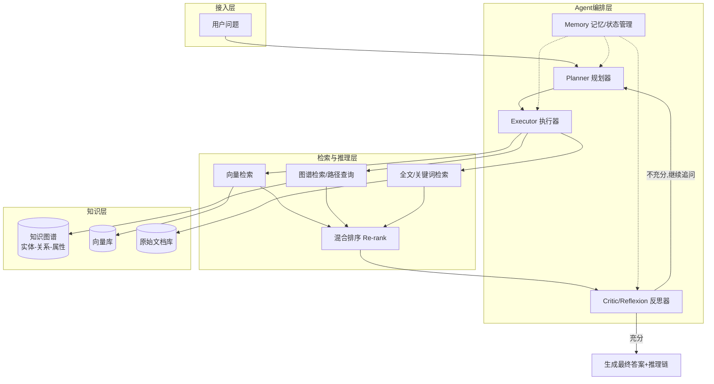

# Agentic GraphRAG（多跳推理）项目立项建议书

**项目代号**：AgenticGraphRAG
**文档版本**：V1.0
**日期**：2026年7月

---

## 一、项目背景

大语言模型（LLM）在知识密集型任务中普遍依赖检索增强生成（RAG）来缓解幻觉、补充私有知识。但传统"向量检索 + 单轮生成"的 Naive RAG 架构在面对**多跳推理（Multi-hop Reasoning）**类问题时表现明显不足，例如：

- "A公司的母公司的CEO，曾经在哪些公司任职？"（需要跨实体、跨文档、跨关系链路推理）
- "某产品的供应商中，哪些同时也是竞品B的供应商？"（需要图结构上的交集/路径计算）
- "去年Q3收入下降的原因链条是什么？"（需要因果链、时间序列上的多步检索）

这类问题的共同特征是：**答案不在单一文本片段中，而分布在多个实体、多个文档、多跳关系路径上**。单纯依赖向量相似度检索容易出现"检索到了相关片段，但拼不出完整推理链"的问题。

因此，业界提出将 **知识图谱（Graph）** 的结构化关系能力，与 **Agent 的自主规划、迭代检索、自我校验能力** 结合，形成 **Agentic GraphRAG**：让Agent像人类专家一样，围绕图谱做"提出子问题 → 图上检索/推理 → 反思是否足够 → 继续下一跳"的闭环。

---

## 二、现状分析与核心痛点

| 痛点 | 传统 Vector RAG | 纯 GraphRAG（无Agent） | 目标：Agentic GraphRAG |
|---|---|---|---|
| 多跳关系问题 | 效果差，易漏检 | 有结构但检索策略固定，不会"追问" | Agent动态分解问题、按需多跳查询 |
| 检索路径可解释性 | 弱（黑盒相似度） | 较强（有路径） | 强，且可展示推理链 |
| 复杂问题分解 | 无 | 无 | 有（Planner分解子问题） |
| 检索结果自我校验 | 无 | 无 | 有（Critic/Reflexion校验是否需要再检索） |
| 动态工具调用（SQL/API/全文检索等） | 无 | 有限 | 支持多工具编排 |
| 成本与延迟 | 低 | 中 | 较高，需要工程优化 |

**结论**：单纯升级检索方式（换Embedding、换图数据库）无法根治多跳推理问题，**根因在于"检索策略是静态的，而问题结构是动态的"**，需要引入具备规划与反思能力的Agent层。

---

## 三、项目目标

### 3.1 总目标
构建一套 **图谱增强的多跳推理智能问答系统**，使系统在复杂、跨实体、跨文档问题上的准确率和可解释性显著优于现有RAG方案。

### 3.2 具体目标（可量化，供验收使用）
1. 在自建的多跳评测集（≥200条，含2跳/3跳/开放式路径问题）上，Answer Accuracy 相较 Baseline（纯向量RAG）提升 **≥25个百分点**。
2. 平均推理跳数 ≥2 的问题，检索命中所需支持证据的 Recall ≥85%。
3. 提供可视化推理链路（子问题拆解 + 图路径 + 引用来源），支持人工审计。
4. 单次查询端到端延迟控制在可接受范围内（目标 P95 ≤ 8s，具体依据业务场景协商）。
5. 支持增量知识更新（图谱可持续吸收新文档/新实体，无需全量重建）。

---

## 四、总体技术方案

### 4.1 总体架构分层

### 4.2 核心模块设计

**① 知识图谱构建层**
- 实体/关系抽取：LLM结构化抽取 + 规则/词典兜底，输出Schema化三元组
- 图谱存储：Neo4j / NebulaGraph / TigerGraph（按数据规模与团队熟悉度选型）
- 图谱质量：实体消歧（Entity Resolution）、关系置信度打分、Schema治理
- 增量更新机制：新文档→抽取→冲突检测→合并入图（避免全量重建）

**② 混合检索层**
- 向量检索：文本chunk级embedding，用于语义相似召回
- 图检索：基于子图遍历/最短路径/多跳邻居查询（Cypher/GQL），用于关系型召回
- 全文检索：BM25兜底，解决专有名词、精确匹配场景
- 融合排序：RRF（Reciprocal Rank Fusion）或学习型Re-ranker融合三路结果

**③ Agent编排层（核心创新点）**
- **Planner**：将复杂问题分解为可执行的子问题序列（支持树状/图状分解，而非单纯链式）
- **Executor**：针对子问题选择检索工具（向量/图/全文/外部API），执行检索
- **Critic（反思器）**：判断当前证据是否足以回答子问题/原问题；不足则触发下一跳检索或改写子问题（借鉴 ReAct / Reflexion / Self-RAG 思路）
- **Memory**：维护"已探索路径、已获得证据、已排除假设"，避免重复检索与死循环

**④ 答案生成与可解释性**
- 基于收集到的图路径+文本证据生成答案
- 输出结构化推理链（子问题→检索到的节点/边→中间结论→最终答案），供审计与用户追溯

### 4.3 关键设计原则
- **图谱是"结构化记忆"，Agent是"决策大脑"**：图谱不直接给答案，而是为Agent提供可靠的多跳导航能力
- **检索策略动态化**：不预设固定跳数，由Critic决定是否继续推理，设置最大迭代次数防止发散
- **成本可控**：并非所有问题都需要走完整Agent循环，需设计"问题复杂度分诊"机制，简单问题走Fast Path（直接向量RAG），复杂问题才进入Agentic多跳流程

---

## 五、关键技术难点与应对思路

| 难点 | 说明 | 应对思路 |
|---|---|---|
| 图谱构建质量 | LLM抽取存在噪声、实体消歧困难 | 人工审核抽样闭环 + 置信度过滤 + 增量迭代治理 |
| Agent循环发散/死循环 | Critic反复要求"继续检索"导致成本失控 | 设置最大跳数上限、预算控制、"未找到答案"兜底策略 |
| 多跳路径爆炸 | 图上邻居/路径数量随跳数指数增长 | 限制子图范围（按相关性剪枝）、Top-K路径采样 |
| 检索融合排序 | 向量分数与图路径分数量纲不一致 | RRF融合或训练轻量级Re-ranker统一打分 |
| 可解释性与审计 | 用户/合规需要可追溯的推理依据 | 强制输出结构化推理链，落库供审计查询 |
| 延迟与成本 | 多轮LLM调用+多次检索，延迟叠加 | 问题复杂度分诊、检索并行化、缓存中间结果 |
| 评测困难 | 多跳问答缺乏现成评测集 | 自建评测集（人工标注+合成数据结合），分跳数分级评测 |

---

## 六、实施计划与里程碑

| 阶段 | 周期(建议) | 目标产出 |
|---|---|---|
| **阶段一：POC验证** | 3-4周 | 小规模图谱（单一领域）+ 基础Agent循环打通，验证技术路线可行性，跑通10-20个多跳case |
| **阶段二：MVP构建** | 4-6周 | 完整四层架构落地；自建评测集(≥200条)；对比Baseline输出量化报告 |
| **阶段三：工程优化** | 3-4周 | 延迟/成本优化、问题复杂度分诊、缓存与并行化、图谱增量更新流程 |
| **阶段四：试点上线** | 2-3周 | 接入真实业务场景小范围灰度，收集用户反馈，建立监控与人工审核回路 |
| **阶段五：规模化推广** | 持续 | 根据试点效果扩展领域图谱，建立长期图谱治理与Agent策略迭代机制 |

> 以上周期为经验参考值，需结合团队规模、数据体量、领域复杂度调整。

---

## 七、团队与资源需求（建议）

- **算法/工程人员**：Agent编排与Prompt工程 1-2人、知识图谱构建 1-2人、检索系统工程 1人
- **基础设施**：图数据库（Neo4j/NebulaGraph等）、向量数据库、LLM API调用预算
- **数据资源**：领域文档语料、可用于标注评测集的人工/众包资源
- **算力/成本预算**：LLM调用成本（Agent多轮调用成本高于单轮RAG，需预留预算）

---

## 八、风险评估

| 风险 | 等级 | 应对措施 |
|---|---|---|
| 图谱构建成本/周期超预期 | 中高 | 先聚焦小范围高价值领域，MVP验证后再扩展 |
| Agent多轮调用成本失控 | 中 | 设置预算上限与复杂度分诊机制，非必要不触发多跳 |
| 效果提升不及预期 | 中 | POC阶段设定明确Go/No-Go指标，避免沉没成本扩大 |
| 团队图谱/Agent经验不足 | 中 | 引入外部技术顾问或参考开源方案（如LightRAG、GraphRAG论文实现）加速验证 |

---

## 九、验收标准（对应第三节目标）

1. ✅ 多跳评测集Accuracy相较Baseline提升≥25个百分点
2. ✅ 多跳问题证据Recall≥85%
3. ✅ 具备可视化推理链输出能力
4. ✅ P95延迟达到约定阈值
5. ✅ 支持知识增量更新且不影响线上服务

---

## 十、附录：可参考的技术/开源方向

- 图谱增强RAG代表工作：Microsoft GraphRAG、LightRAG、HippoRAG
- Agent推理范式：ReAct、Reflexion、Self-RAG、Plan-and-Solve
- 图数据库选型：Neo4j（生态成熟）、NebulaGraph（国产分布式，大规模场景）、TigerGraph
- 评测参考：HotpotQA、2WikiMultihopQA 等多跳QA数据集的构造思路可迁移到自有领域

---

*本建议书为立项讨论初稿，具体人力、周期、指标需结合实际业务场景与数据情况在评审会上进一步确认。*
