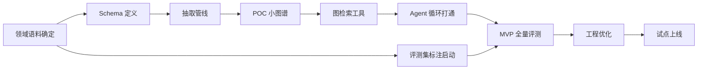

# 总路线图（Roadmap）

**关联**：[PRD 第8节 里程碑](../PRD.md) · 各阶段详细计划见 [phases/](./phases/)

## 1. 时间线总览（以启动日 T0 起算，周为单位）

```
周:      1  2  3  4  5  6  7  8  9  10 11 12 13 14 15 16 17 18+
阶段一 POC     ████████░
阶段二 MVP              ████████████░
阶段三 优化                          ████████░
阶段四 试点                                   ██████░
阶段五 规模化                                        ═══════════▶
门禁:          G1        G2           G3      G4
```

| 阶段 | 周期 | 起止（建议） | 门禁 |
|---|---|---|---|
| 阶段一 POC 验证 | 3-4周 | T0 ~ T0+4w | **G1**：技术路线 Go/No-Go |
| 阶段二 MVP 构建 | 4-6周 | T0+4w ~ T0+10w | **G2**：效果达标趋势确认 |
| 阶段三 工程优化 | 3-4周 | T0+10w ~ T0+14w | **G3**：性能/成本达标 |
| 阶段四 试点上线 | 2-3周 | T0+14w ~ T0+17w | **G4**：全部验收项通过 |
| 阶段五 规模化 | 持续 | T0+17w ~ | 按试点数据另行立项 |

> 周期为经验参考值（沿用立项建议书），实际以评审会确认为准。阶段间允许 1 周内的工作流并行重叠（如 MVP 期间提前准备评测集标注）。

## 2. 阶段门禁（Go/No-Go 判据）

### G1 — POC 出口（决定项目是否继续）
- [x] 10-20 个真实多跳 case 端到端跑通（问题→分解→图检索→答案）— 20/20 offline seed
- [x] 其中 ≥60% case 答案正确且推理路径合理 — **20/20 = 100%**（interim 语料，见 `reports/G1_review.md`）
- [x] 单 case 成本与延迟数据已采集，无量级失控 — offline 成本 0，latency max≈14ms
- [x] 图谱抽取质量抽检可用 — seed baseline 23 条 100%（schema-valid）；LLM 抽检待正式语料
- **结论（2026-07）**：**Conditional-Go** — 见 `reports/G1_review.md`
- **No-Go 处理**：输出根因分析报告，评审决定调整路线或终止，避免沉没成本扩大。

### G1 → G2 过渡条件（Conditional-Go 关闭项，进入阶段二全量前）

完整 playbook：[`phases/g1-to-g2-transition.md`](./phases/g1-to-g2-transition.md)  
一键：`./scripts/g1_to_g2_gate.sh` → `reports/G1_to_G2_status.json`

| 条件 | 任务 | 通过判据 | 状态 |
|------|------|----------|------|
| C1 真实试点语料 | P1-GOV-01 | ≥100 篇 + 授权 + MANIFEST | ✅ 工程 PASS（合成 226 篇；产品真域 caveat） |
| C2 实时 LLM 重跑 | P1-EV-04 | 抽取人工抽检 ≥70% + 20 case live 报告 | ✅ 自动化 PASS（live 质量 caveat / 403） |
| C3 Neo4j 回归 | P1-EV-05 | `build-graph` + `run-cases --neo4j` | ✅ pass_partial（offline Neo4j 14/20） |

> 详见 `reports/G1_to_G2_status.json` · closeout。工程入场 **ALLOWED**；效果门禁仍须真域 + 满配额 live。

### G2 — MVP 出口
- [x] 全部 P0 需求（PRD 第3节）**代码侧**实现并通过单元测试
- [x] 评测集 ≥200 条（自动金标 + 规范）；一键评测可用（`agr-eval` / `evals/run.py`）
- [~] Accuracy 较 Baseline 提升趋势（**dev offline** 已见 ≥15pp；**heldout/live 正式关**仍开）
- [~] 证据 Recall ≥75%（**dev offline** 达标；heldout offline 见 `scripts/p3_ev_offline.py`）

### G3 — 优化出口
- [ ] AC-4：Agentic P95 ≤ 8s；Fast Path P95 ≤ 3s — **仅 offline 脚手架**
- [~] AC-6：护栏专项 offline 通过；生产熔断待部署验证
- [ ] AC-1/AC-2 最终达标：+≥25pp / Recall ≥85% — **需 live held-out**
- [~] 增量更新流程演练（AC-5）— offline smoke：`reports/g3_offline/incremental_drill.json`

### G4 — 试点出口
- [ ] PRD 第7节全部验收项（AC-1 ~ AC-7）通过
- [ ] 灰度用户反馈收集 ≥2 周，badcase 库建立
- [ ] 监控告警、预算熔断、审计回查在生产环境验证

## 3. 关键依赖关系



**关键路径**：领域语料确定 → 图谱构建 → 图检索 → Agent 循环 → 评测。
**最早启动项**（T0 立即开始，不等依赖）：
1. 首个试点领域与语料确定（开放问题 #4，阻塞一切）
2. 图数据库/向量库选型（开放问题 #1）
3. 评测集问题设计（可与 POC 并行，标注在 MVP 期完成）

## 4. 各阶段需求范围映射

| 阶段 | 功能需求范围 | 对应验收项 |
|---|---|---|
| POC | FR-KG-01~03、FR-RT-01~03、FR-AG-02~07、FR-AN-01~02（最小实现） | — |
| MVP | 全部 P0 + FR-OP-04 | AC-1/2 趋势 |
| 优化 | 全部 P1（FR-AG-01 分诊、FR-RT-04/05、FR-KG-04/05/06、FR-OP-01/02、FR-AN-03/04、FR-API-02/03） | AC-4/5/6 |
| 试点 | FR-API-05、FR-OP-03 | AC-1~7 全部 |
| 规模化 | P2（FR-KG-07、FR-AG-08、FR-AN-05） | 另行定义 |
